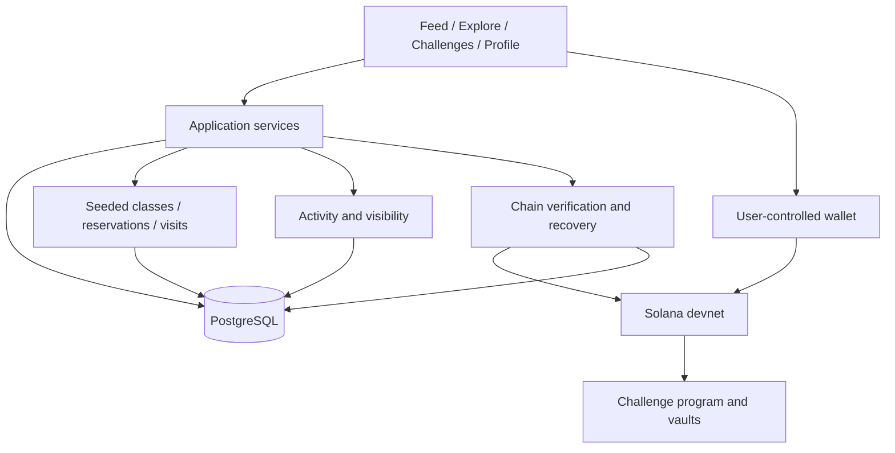

# RepX Club — Hackathon MVP specification

Last updated: 21 September 2026. **Project status:** The branded frontend preview is implemented under ticket DEV0008, with locally persisted demonstration flows. The local database/schema foundation and server boundary are implemented. Completed DEV0027 added the Devnet-only Phantom Wallet Standard connection UI and real-extension rehearsal; completed DEV0038 added local Supabase Web3 authentication and verified wallet/session states; completed DEV0039 added prepared Anna enrollment and the durable personal wallet binding, including a real enrollment/disconnect/reconnect rehearsal. Protected application data, balances, transaction signing and the Solana program do not exist. Embedded onboarding is retained in blocked DEV0037 because Phantom Portal pauses new developer sign-ups. Local UI fixtures do not satisfy real devnet acceptance criteria. The [paid-event refinement in ticket DEV0008](../tickets/archive/frontend/DEV0008-repx-club-frontend.md#refinement-0013) adds paid-event discovery, local event drafts and a ticket-purchase preview; real event payments and authorized redemption are still outstanding.

The discovery refinement in [DEV0020](../tickets/archive/frontend/DEV0020-discovery-and-how-it-works.md) adds richer challenge cards, search/filter/order controls, a public How it works guide, copy links and related activities. These remain frontend previews; live state-dependent entry/voting/claims still require backend/program delivery.

The accepted social refinement in [DEV0022](../tickets/archive/backend/DEV0022-social-contract-and-delivery-plan.md) defines Community/Following feeds and Cheer reactions. It is documented, not implemented: the current preview still has For you/Following fixture activity and local follows; shared profiles, feeds, reactions and database migrations remain future work.

**Brand:** RepX Club. **Hackathon tagline:** Social fitness, onchain.

## Authority and maintenance

**This is the single source of truth for the current MVP:** product scope, behavior, architecture, milestones, acceptance criteria and demo instructions. This revision replaces the earlier booking-focused baseline. The [archive](archive/2026-09-18/) and completed tickets describe historical decisions; they do not override this document. The source Word proposal and EURC wallet discussion are background; their accepted requirements are incorporated here rather than maintained as additional specifications.

[AGENTS.md](../AGENTS.md) owns contributor workflow. The [ticket index](../tickets/README.md) owns execution status. Changes to product behavior must update this document and their ticket together. README owns navigation and application setup instructions.

**Decision status:** C01–C19 below are confirmed direction/constraints. P01–P05 and P07 remain explicitly proposed product defaults, not individually approved user decisions. P06 is resolved by the user's EURC-only choice. P08 is resolved for the hackathon MVP by using prepared Phantom wallets; the preferred embedded experience is deferred because Phantom Portal pauses new developer sign-ups. This does not introduce email-code login, fee sponsorship or unattended signing. These IDs are referenced where they affect behavior. Resolve the remaining affected P items before freezing financial rules or presenting them as final to users; independent implementation planning can continue. Architecture and delivery choices are not evidence of implemented functionality.

### Navigation

- [Confirmed scope](#confirmed-target-and-decisions), [proposed defaults](#proposed-defaults-to-resolve), [product](#1-product-promise-and-scope), [screens](#2-screens-and-actions).
- [Evidence](#4-participation-and-attendance-evidence), [architecture](#5-architecture-and-storage), [challenges](#6-challenge-contract-and-settlement), [passes](#7-class-passes-payments-and-refunds).
- [Wallet/demo integrity](#8-asset-wallet-and-demo-integrity), [social behavior](#9-social-behavior-and-permissions).
- [Definition of done](#10-definition-of-done), [milestones](#11-delivery-milestones), [acceptance](#12-acceptance-matrix), [demo](#13-demo-script), [follow-ups](#14-stretch-and-follow-up-boundaries).

<a id="confirmed-target"></a>

## Confirmed target and decisions

| ID  | Confirmed direction or constraint                 | Current contract                                                                                                                                                                                                                                                                                                                                                                                                                                                                     |
| --- | ------------------------------------------------- | ------------------------------------------------------------------------------------------------------------------------------------------------------------------------------------------------------------------------------------------------------------------------------------------------------------------------------------------------------------------------------------------------------------------------------------------------------------------------------------ |
| C01 | Hackathon demo first                              | Responsive web app, simulated gym operations, real Solana devnet transactions, test funds only. No real money or live gym inventory.                                                                                                                                                                                                                                                                                                                                                 |
| C02 | Community creation is central                     | Individuals, trainers, gyms and organizations use the same simple challenge-creation flow. The differentiator to test is accessible, flexible creation for existing communities.                                                                                                                                                                                                                                                                                                     |
| C03 | Both challenge modes                              | Community participants fund the pool and vote. A sponsored challenge is funded by its creator, who selects the winner. Both modes belong in the MVP.                                                                                                                                                                                                                                                                                                                                 |
| C04 | Community quorum                                  | At least 50% of registered participants must cast valid votes, rounded up. This is voter participation, not a requirement that the winner receive half of all participants' votes.                                                                                                                                                                                                                                                                                                   |
| C05 | Predictable fallback                              | Below quorum at the community voting deadline, split the pool equally among participants. If the sponsored creator has not selected a winner within 24 hours after challenge end, split that pool equally among participants.                                                                                                                                                                                                                                                        |
| C06 | Challenge cancellation before start               | Return community contributions to their original participants; return sponsored funding to the creator. This is a return of deposits, not a winner payout.                                                                                                                                                                                                                                                                                                                           |
| C07 | Gym discovery and real devnet class-pass purchase | Seeded gym discovery remains. A dated class pass can be purchased using real test-token transfers; a simulated payment alone does not satisfy the demo.                                                                                                                                                                                                                                                                                                                              |
| C08 | Late purchase and no-show restrictions            | A pass purchased when class starts in less than 24 hours is non-refundable for customer cancellation. A no-show is also non-refundable. The broader cancellation-time cutoff remains P01.                                                                                                                                                                                                                                                                                            |
| C09 | Gym-confirmed visits                              | Staff confirmation is required to record a visit. Membership users can participate without buying another pass. Booking, payment and social intent do not prove attendance.                                                                                                                                                                                                                                                                                                          |
| C10 | Remove on-chain badges                            | No badge mint, NFT, on-chain achievement claim or badge signing prompt is required or a stretch feature for this MVP. Off-chain visit counts and ordinary status labels remain useful.                                                                                                                                                                                                                                                                                               |
| C11 | Class joins in the social feed                    | Confirmed class bookings can appear in the user's public app activity. Preserve ticket DEV0004's visible sharing controls, private payment details and distinction between joining and attending.                                                                                                                                                                                                                                                                                    |
| C12 | Simplest wallet setup for the demo                | Use prepared Phantom wallets and test funds for the hackathon so unavailable provider registration does not block delivery. Participants connect the normal Phantom browser wallet; company operators use separate prepared company wallets. Preserve embedded onboarding as a follow-up under P08 rather than an MVP dependency.                                                                                                                                                    |
| C13 | EURC-only MVP                                     | Circle Solana Devnet EURC is the sole token for pass prices, challenge entries, sponsored pools, payouts and refunds. Test SOL pays network/account costs only. No other payment asset, token selector, swap or fiat conversion. P06 records the resolved asset choice.                                                                                                                                                                                                              |
| C14 | Separate business and personal funds              | Every gym/company used for financial flows has a dedicated business wallet, separate from its admin's personal wallet. Company receipts, sponsorship funding and returns use the company wallet; challenge pools remain in program-controlled vaults.                                                                                                                                                                                                                                |
| C15 | Honest private balances                           | Show available test EURC separately from committed contributions and payouts awaiting transfer. Keep personal and business balances separate and clearly label test funds; no locked or unclaimed amount is spendable.                                                                                                                                                                                                                                                               |
| C16 | Paid community events                             | Individuals, cafés, trainers, gyms and organizations can host a paid experience with a benefit included for every valid ticket. Events have no prize pool, winner or voting. Discover them alongside classes in Explore; use a ticket flow with payment to the host and single-use host redemption, separate from gym-confirmed visits. Frontend previews/local drafts are implemented; real devnet purchase/redemption and event-specific refund terms remain to implement/resolve. |
| C17 | Public Explore and Challenges                     | Everyone can browse Explore and the public Challenges catalogue without an account, wallet connection or demo enrollment. Public listings, filters and details stay accessible after Auth/database integration. Private drafts, restricted challenge data and personal/participation actions retain sign-in and authorization requirements.                                                                                                                                          |
| C18 | Discovery clarity and guidance                    | Apply the accepted public discovery improvements: comparable challenge cards, search and activity/chronological discovery, consistent rule summaries, public sharing/related activities, and an easy-to-find How it works guide. Live next-action controls depend on verified backend/program state; current fixtures remain explicitly previews.                                                                                                                                    |
| C19 | Bounded social interaction                        | One-way follows without friend requests; chronological Community and Following feeds; one removable Cheer per person per activity; open an activity to book/join independently; share activity links while preserving visibility. Personal social activity remains authenticated and scoped to the same demo run. Defer comments, direct messages, notifications, general posts and algorithmic ranking. All social data remains off-chain.                                          |

### Proposed defaults to resolve

P01–P05 and P07 remain working recommendations for the examples, plan and acceptance cases below. P06 and P08 are retained under their original IDs with their resolutions recorded. Changing a choice requires updating its dependent sections, not another product document.

| ID  | Choice                              | Working default / resolution                                                                                                                                                                                                                                                                                                                                                                                                                                                                                                                                                                                               | Dependency / status                                                                                                                   |
| --- | ----------------------------------- | -------------------------------------------------------------------------------------------------------------------------------------------------------------------------------------------------------------------------------------------------------------------------------------------------------------------------------------------------------------------------------------------------------------------------------------------------------------------------------------------------------------------------------------------------------------------------------------------------------------------------- | ------------------------------------------------------------------------------------------------------------------------------------- |
| P01 | Full pass-refund policy             | Full original pass-price refund only when cancellation is requested at least 24 hours before class start; exactly 24 hours qualifies. No refund closer to start or for a no-show. Gym cancellation or inability to deliver a paid pass gets a full refund regardless of that cutoff. Network/account costs are separate.                                                                                                                                                                                                                                                                                                   | Pass policy implementation and checkout wording.                                                                                      |
| P02 | Community voting deadline           | Voting opens at challenge end and lasts 24 hours. Settle community results only after that window closes, even if quorum arrives early. Sponsored selection already has the confirmed 24-hour deadline.                                                                                                                                                                                                                                                                                                                                                                                                                    | Challenge time parameters and settlement tests.                                                                                       |
| P03 | Voting, winners and ties            | One final vote per registered participant, no self-voting; highest vote count wins after quorum; tied top candidates share equally. The sponsored creator selects one registered participant and cannot enter their own sponsored challenge or award the prize to themselves. The program enforces registration/authority, not fitness merit.                                                                                                                                                                                                                                                                              | Vote and winner-selection instructions.                                                                                               |
| P04 | Funding and bounded participation   | Equal fixed contributions for community members; sponsored entry is free. Use invite/allowlist entry, minimum 3 community participants, minimum 1 sponsored participant and maximum 10 participants per demo challenge. A community creator may enter by paying the same stake. Creator cancellation is allowed before start; no individual paid-entry withdrawal or post-start cancellation in this MVP. Below the minimum at start, cancel and return deposits.                                                                                                                                                          | Creation/entry contracts and start-time recovery.                                                                                     |
| P05 | Who receives an equal fallback      | All participants registered at start, including abstainers and non-completers. A sponsor is not a fallback beneficiary merely for funding. With no participants, return sponsored funds to the creator. Freeze the roster at start; no later removals can change the denominator.                                                                                                                                                                                                                                                                                                                                          | Beneficiary allocation and creator disclosures.                                                                                       |
| P06 | Token coverage                      | **Resolved 19 September 2026 — user decision, C13:** Circle Solana Devnet EURC only for every payment, pool and return. Pin the exact mint/cluster; no other token or exchange-rate conversion. SOL is only for network/account costs.                                                                                                                                                                                                                                                                                                                                                                                     | Adopted for asset configuration, all fixtures and payment rehearsal; no transfers performed by this specification update.             |
| P07 | Definition of a gym visit           | Count at most one confirmed visit per user, gym venue and venue-local calendar day. Two classes at that venue on the same day redeem separately but increment the visit total once. Staff confirms during the class window through 30 minutes after scheduled end; late corrections require a later operational policy.                                                                                                                                                                                                                                                                                                    | Check-in model, attendance UI and challenge progress.                                                                                 |
| P08 | Demo identity and wallet onboarding | **Resolved 20 September 2026 — revised user decision under C12, retaining C14:** use prepared Phantom wallets on Solana Devnet for the MVP. Participants and organizers connect the normal Phantom extension; every financially active company uses a distinct prepared company wallet. Owners approve authentication and financial signatures; test funds are prepared in advance. Phantom Connect embedded onboarding is retained in DEV0037 but deferred until Portal registrations/App ID access are available. Defer email/SMS login, automatic account merging, auto-confirm, delegated signing and fee sponsorship. | Selected for MVP implementation and rehearsal; Node prerequisite complete, extension behavior in DEV0027, embedded follow-up blocked. |

The confirmed C08 rule must hold even while P01 is unresolved. A passage describing P01 is a proposed complete policy, not a claim that the user already approved the cancellation-time interpretation. P06 now resolves token coverage; it does not resolve unrelated refund, voting or attendance policies.

## 1. Product promise and scope

> Create a challenge or event for your community, discover somewhere to train, and join others under clear participation and payment rules.

The core loop is **create/discover → join → participate → vote or judge → receive rewards → share activity**. Gym discovery, class passes and gym-confirmed visits make participation concrete. Challenges need not require a class purchase: members and friends can participate using existing access. Paid events follow a separate loop: discover/create → buy a ticket → participate → redeem the included benefit. Payment buys an experience for every ticket holder, not entry into a prize pool.

| Required MVP capability                    | Bounded implementation                                                                                                                                                                          | Deferred                                                                                                                  |
| ------------------------------------------ | ----------------------------------------------------------------------------------------------------------------------------------------------------------------------------------------------- | ------------------------------------------------------------------------------------------------------------------------- |
| Community and sponsored challenge creation | Shared form; mode, activity/rules, dates, test-EURC amount, invited wallets and fixed settlement terms                                                                                          | Complex scoring, multiple funding modes in one pool, unrestricted large groups                                            |
| Challenge participation and settlement     | Real devnet deposits, participant votes or creator selection, fallback, cancellation returns and observable payouts                                                                             | GPS/health oracle, automated fitness adjudication, production disputes                                                    |
| Feed, profiles, follows and Cheers         | Structured class-join/challenge activity; display profiles; one-way follows; chronological Community/Following feeds; removable Cheer; links to participate and share under visibility controls | Free-form workout posting, comments, direct messages, notifications, multiple reaction types, algorithmic recommendations |
| Gym and trainer discovery                  | Three seeded gyms, trainer affiliations across gyms, small dated class list and associated challenges                                                                                           | Live provider API integrations, merchant onboarding, comprehensive scheduling                                             |
| Paid community events                      | Seeded Run & Coffee event, local event creation drafts, dated ticket and explicit inclusions; reuse the pass payment/recovery architecture for devnet host receipts and single-use redemption   | General merchant onboarding, ticket resale, multiple redemptions, recurring event series                                  |
| Class access                               | One class-specific pass, devnet checkout, cancellation/refund recovery; seeded direct membership access                                                                                         | Packs, recurring subscriptions, rescheduling, waitlists, external booking simulator                                       |
| Gym-confirmed visits                       | Restricted staff confirmation, redemption, deduplicated visit count and related challenge progress                                                                                              | Automated location verification, medical/health data ingestion, anti-fraud guarantees                                     |
| Wallet balance and business separation     | Private available test-EURC summary, distinct commitments/claims and separate company wallet context                                                                                            | P2P transfers, signup/promotional rewards, platform rewards treasury, consumer add-funds or cash-out flows                |
| Responsive demo                            | Feed, Explore, Challenges, Profile; real transaction receipts and honest simulation labels                                                                                                      | Native apps, mainnet, fiat ramps, bank payouts, on-chain badges                                                           |

Both challenge modes, the paid pass path and visit confirmation are required. If time is tight, reduce catalogue size, visual extras and feed interaction depth first. Do not silently remove a confirmed core flow. The class list and minimal reservations exist to support dated passes; full booking-provider orchestration is no longer the project's central architecture.

### Business differentiation and validation

The target is a small existing fitness community: a trainer's students, a gym cohort, friends, or an organization's activity group. Any of those organizers should be able to define an activity, invite their community and fund or pool a modest prize through the same flow. Test flexible activities and short durations, local gym participation and transparent prize handling together.

Do not pitch community creation alone as unique. Strava has [Group Challenges](https://support.strava.com/en-us/articles/15401736-how-do-group-challenges-work-on-strava), and StepBet offers [player-created games](https://www.stepbet.com/faq/create-game). Our proposed differentiation is less setup effort for small organizers, flexible human-judged challenges, and a connected local participation experience. This is a hypothesis requiring comparison and user evidence.

The distribution hypothesis is organizer creates → invites existing community → participants train/join → some participants create another challenge. Gym discovery can convert that activity into visits and paid classes. Trainer identities stay independent of gyms; affiliations are many-to-many.

Keep existing memberships useful. Urban Sports Club/Wellhub and provider systems are possible later access/distribution partners; this MVP neither replaces their entitlement networks nor assumes API access. Unknown external membership is not proof of a booked class. Defer external-provider booking flows; use a seeded direct membership for the no-purchase demo path.

The demo takes no platform commission from passes or challenge pools. Gyms set explicit pass prices; all accounted challenge funds go to the specified recipients. This is a demo rule, not proof of a sustainable zero-commission business. Later revenue hypotheses include organizer software, paid organization tools and sponsored campaigns. Do not claim universal gym payout rates, guaranteed payment savings or aggregator migration economics.

Measure organizer creation completion/time, invite-to-join conversion, paid entry completion, voter turnout, time to payout, repeat challenge creation, and class discovery-to-confirmed-visit conversion. Keep fixture activity separate from real user validation; small organizer interviews and observed task completion are stronger business evidence than seeded usage counts.

## 2. Screens and actions

Primary navigation is **Feed · Explore · Challenges · Profile**. Details and operator tools are secondary views, not additional main tabs.

| Surface                                   | Content and actions                                                                                                                                                                                                                                                                                                                                                                                                                                                                                                                                                                                                                                                                                                                                                                                                                                                                                                                                                       |
| ----------------------------------------- | ------------------------------------------------------------------------------------------------------------------------------------------------------------------------------------------------------------------------------------------------------------------------------------------------------------------------------------------------------------------------------------------------------------------------------------------------------------------------------------------------------------------------------------------------------------------------------------------------------------------------------------------------------------------------------------------------------------------------------------------------------------------------------------------------------------------------------------------------------------------------------------------------------------------------------------------------------------------------- |
| Feed `/`                                  | Social home for signed-in users in the same demo run: chronological Community and Following tabs, structured class joins and shared challenge activity, Cheer controls, profile links and activity destinations. Community means visible activity across that run; Following means activity by followed people/trainers. Guests see a sign-in/discovery entry state without personal activity; Explore/Challenges remain public. No general post composer. Current preview still uses For you/Following fixtures until DEV0023.                                                                                                                                                                                                                                                                                                                                                                                                                                           |
| Explore `/explore`                        | Three tabs: **Classes** and **Events**, each with activity, venue-local date and start-time-of-day filters; **Studios** with activity filtering only. Each tab keeps independent filter choices; class/event date/time never filters studios or each other. Events show a dated ticket price, host and inclusions; local event drafts appear separately from the public demonstration catalogue. `/explore?view=events` opens Events directly. Classes default to all demo dates/times and display standard test-EURC pass prices. Studios show one card per venue, area and offered activities; a studio details view links to its classes. Global search may supply a clearable query context; no additional Explore search field. No membership filter or promotional membership labels on Explore; personal access eligibility is shown on the class detail/booking page. Gym detail shows location, trainers, passes and linked challenges. No live-inventory claim. |
| Class `/classes/:id`                      | Start/end time and timezone, gym, trainer, simulated availability, access options, test-EURC price and frozen refund policy. Visible “Share this class in my public activity” toggle defaults on; book with seeded membership or purchase a class pass.                                                                                                                                                                                                                                                                                                                                                                                                                                                                                                                                                                                                                                                                                                                   |
| Event `/events/:id`, create `/events/new` | Host, meeting point, local date/time, duration, capacity, ticket price and inclusions for everyone; no winner, pool or voting. Current checkout is an informational preview. Validated local drafts can be saved, reloaded and deleted; no live publication or ticket issuance. Host identity in a draft is descriptive, not authorization.                                                                                                                                                                                                                                                                                                                                                                                                                                                                                                                                                                                                                               |
| Challenges `/challenges`                  | Sponsored/community and My Challenges; create, join and inspect pool funding. Detail shows rules, roster, progress, dates, quorum/judging state, outcome, claimable amount and verified payout. Prize examples explicitly state how to win, who judges and what the winner receives; no invented awarded winner. A link points noncompetitive gatherings to Events.                                                                                                                                                                                                                                                                                                                                                                                                                                                                                                                                                                                                       |
| Create `/challenges/new`                  | Same form for a person, trainer, gym or organization; select mode, rules/activity, dates, test-EURC amount and invite roster. Review funding, decision deadline, cancellation and fallback before signing. Company actions require the company's wallet and authorized admin context. Creator type does not change settlement rules.                                                                                                                                                                                                                                                                                                                                                                                                                                                                                                                                                                                                                                      |
| Profile `/profile`, `/users/:id`          | Display identity, visible activity, followed profiles, visit count and permitted challenge history. The owner's private view includes their available test-EURC balance and separate committed/claimable summaries; never expose these on public profiles. Owner can hide shared items and open private passes/receipts. Keep the demo personal profile focused: no membership promotion card or business-wallet explanation/example; company tools belong in the authorized operator context. Membership eligibility stays in class detail/booking. No on-chain badge gallery.                                                                                                                                                                                                                                                                                                                                                                                           |
| Trainer `/trainers/:id`                   | Bio, gym affiliations, class/challenge links and follow toggle. No trainer payroll/onboarding system.                                                                                                                                                                                                                                                                                                                                                                                                                                                                                                                                                                                                                                                                                                                                                                                                                                                                     |
| My passes `/passes`, `/passes/:id`        | Pending/confirmed/redeemed/cancelled/no-show status, private payment/refund receipt and sharing/cancellation controls. Show recovery and outstanding refund separately.                                                                                                                                                                                                                                                                                                                                                                                                                                                                                                                                                                                                                                                                                                                                                                                                   |
| Restricted tools `/demo`                  | Gym-specific staff check-in, challenge creator actions, company-wallet balance and refund preparation, fixture/failure controls and fresh-run creation. Only the authorized company admin can view/use its financial controls. Never a public unrestricted organizer or wallet switch.                                                                                                                                                                                                                                                                                                                                                                                                                                                                                                                                                                                                                                                                                    |

Explore initially includes all demo dates and times. Class and event date filters match the scheduled Berlin-local calendar date; time presets use the scheduled start: morning before 12:00, afternoon from 12:00 through 16:59, and evening from 17:00. Studios match their offered activities independently of class availability. Resetting a tab restores that tab’s filters and clears any shared global-search query.

Challenge state and financial state must be visible separately: “Decision recorded · payout available” is different from “Paid.” A compact private balance summary is sufficient; no separate wallet tab or consumer transfer dashboard is needed. Use explicit loading, pending, failure and recovery states; check phone/desktop layouts and keyboard use.

### Visual design direction — 21 September 2026

The accepted visual reference is the first [club homepage concept](design/DEV0043-preferred-concept.png), delivered by [DEV0043](../tickets/archive/frontend/DEV0043-playful-club-ui-redesign.md). Keep the interface polished and approachable: warm cream surfaces, charcoal text, lime primary accents, selective lilac/coral panels, bold display headings and photographic imagery with a few small decorative marks. The more cartoon-heavy second proposal was rejected; avoid mascots, pervasive handwriting and dense decorative slogans.

The [DEV0044 refinement](../tickets/archive/frontend/DEV0044-club-illustration-and-brand-polish.md) adds a stacked text wordmark (compact on phones), the visible “Social fitness, onchain.” signature, and small decorative outline shoe/star marks. Use a candid group-of-friends hero photograph with a soft transition into the lilac panel; blend vertically on narrow phones. Keep decorations clear of controls and use illustrative imagery without implying real members.

Use “FIND YOUR PEOPLE. MOVE TOGETHER.” as the home hero, supported by “Discover local gyms and studios, join classes, and take on challenges together.” The hero introduces the experience above the Feed; its Explore/Challenges links use existing public routes. The rail highlights example studios and Run & Coffee using current catalogue destinations. Studio photography is illustrative, not evidence of a venue partnership. Retain explicit preview/payment labels and working sign-in/wallet controls.

Use home, dumbbell, trophy and person icons for Feed, Explore, Challenges and Profile. Match the first concept’s compact rounded navigation links with charcoal labels and a lime selected background; omit the trailing active dot. Keep these icons and a clear selected background on mobile. Apply the shared typography, rounded surfaces and restrained accents across existing screens. Keep body text, dates, prices, forms and financial rules clear; preserve visible keyboard focus, reduced-motion support and mobile navigation. Condense the hero/photo on phones. The mockup does not introduce backend Cheers, language metadata, new filters or new social behavior: those require their own product/data work; existing For you/Following preview behavior stays until DEV0023.

### Discovery and How it works

Challenge cards show example entry cost, start date, decision method and prize pool, with explicit preview/unfunded labels. The compact introduction links to the public guide. Text search matches title, activity, description and organizer; activity and Community/Sponsored filters intersect. Starting soon orders explicit fixture start dates; Newest orders explicit creation timestamps, with deterministic title tie-breaking. Neither option invents a live registration status from the wall clock. Saved retains its local bookmark behavior; My drafts remains separate from public discovery.

The shared header has no search bar or mobile search shortcut (DEV0045). Visitors browse through Explore and Challenges and their existing filters. The secondary public `/search?q=…` route remains functional for direct URLs and existing links. Group public seeded results by Classes, Studios, Events and Challenges; match title, activity, venue/organizer/coach/location fields as applicable. Studio results link to the filtered Studios view. Empty and invalid/repeated queries show a useful search start state; no results offers reset/browse paths. Do not index private browser drafts. Keep Explore's existing filters and avoid adding another Explore text-search field.

A visible **How it works** link in the shared header opens `/how-it-works` on desktop and mobile. The guide explains discover → choose → participate, then distinguishes classes, benefit-for-every-ticket events, participant-funded voting challenges and creator-funded judged challenges. Include short expandable wallet, test-fund, cancellation and organizer answers. Explain what visitors can try now versus the planned authenticated/devnet flow. Link directly to public Explore tabs and community/sponsored challenge lists; no new primary navigation tab, automatic signup or wallet prompt.

Every challenge detail presents five consistent answers: activity requirement, entry/prize, decision-maker, decision window and fallback/cancellation. Preserve explicit winner criteria for the sponsored example and keep proposed defaults labelled. Full participation/cancellation terms remain available in an expandable section. The existing entry panel shows preview/not-open status and a save/read-rules next step, plus an explanatory join → participate → vote/judge → claim sequence. Later M2 integration replaces that explanation with the applicable verified action/deadline; claimable and paid remain different. No fake state switcher, countdown or active vote/claim button is introduced now.

Public seeded challenge and event details offer **Copy link**, excluding query strings and private draft routes. Clipboard denial/unavailability reveals a labelled selectable URL and never reports false success. Related catalogue links use explicit venue association when available, otherwise matching activity; exclude the current item and cap the list. These links grant no private access or participation rights. Draft event details have no share control or related public publication claim.

### Public browsing and sign-in boundaries

**Confirmed under C17:** `/explore` and `/challenges` are public routes in both preview and database modes. Visitors can directly open, reload and filter them without an account, provider session, wallet or demo enrollment. Explore's Classes, Events and Studios tabs and the discoverable community/sponsored challenge lists stay usable when signed out. Public class, event, studio and challenge details are part of discovery; opening their links does not require login.

Guest challenge details expose only discoverable content: title, organizer display information, rules, dates, entry terms and accurately labelled prize/funding/outcome summaries. Public visibility does not override invitation or participation eligibility. Private drafts and restricted challenges are excluded from guest listings and detail responses; invitation rosters, protected progress, wallet bindings, personal claims, receipts and attendance history remain protected. Signing out clears personalized content from these routes without removing the public catalogue.

Personal feed/profile reads and Cheer controls follow section 9's signed-in same-run boundary; sign-out removes personal social content and reaction state. Creating/saving a draft, My Challenges, bookmarks/follows, cheering, booking, buying a ticket, joining, voting and claiming require sign-in and the existing role/eligibility checks. Guests may see action controls; attempting one opens sign-in rather than performing a mutation. After successful sign-in, return to the intended internal destination and retain relevant listing filters, then revalidate eligibility. Never automatically book, join, pay or request a financial signature because login completed. Dismissing or rejecting sign-in leaves public browsing available. Public browsing does not require enabling unrestricted demo registration. `/search` and `/how-it-works` are also public, with search restricted to the same discoverable catalogue.

This access rule covers discovery, not anonymous access to personal social activity. Section 9 still governs feed/profile sharing and private challenge data. DEV0038 now supplies local wallet authentication, but it grants no prepared application identity or private product access by itself. The real guest/private boundary is completed through DEV0039–DEV0040, DEV0017 and the social endpoint checks in DEV0023–DEV0024.

## 3. Demo fixtures and account model

- **Anna:** participant with a seeded membership; can book and receive staff-confirmed visits without a pass purchase.
- **Max and Daniel:** participants with distinct prepared Phantom Devnet wallets; one buys the demo class pass. All three enter the community voting example.
- **Organizer/operator:** prepared user with a personal Phantom wallet and primary-admin authority for the demo company. The company has a different Phantom wallet for receipts, pass refunds, sponsored funding and sponsor decisions. Gym staff can confirm only their assigned venue; staff status alone grants no financial authority.
- **Trainer:** profile affiliated with two gyms; may create challenges using the same creator flow.
- **Catalogue:** three clearly labelled demonstration gyms, a small dated class list and linked gym/trainer challenges. Names, schedules and affiliations are fixtures, not claimed partnerships.
- **Event fixture:** Run & Coffee at the illustrative Sunday Coffee café in Kreuzberg, 27 September 2026 at 09:00 Berlin time; 90 minutes, 12 places, 2 test EURC per ticket. Every ticket includes a social 5K and one regular coffee (espresso, americano or filter coffee). No prize or voting. A ticket is redeemed once by the authorized host when serving the coffee; no gym visit is created.
- **Explicit winner example:** Show-up Club at Fabrik Training has one selected winner receiving the full 10 test EURC sponsored pool. The example ranks participants with at least three confirmed visits by eligible visit count; the organizer chooses among tied leaders based on welcoming/encouraging others. This is an illustrative human judging rule, not automated chain scoring. Nobody qualifying means no selection and the confirmed 24-hour equal fallback; no actual winner/funding is claimed. P03/P07 remain proposed platform defaults.
- **Challenge fixtures:** one 3-person community pool at 2 test EURC each; one company-sponsored prize at 10 test EURC. Provide separately prepared success, timeout and pre-start cancellation examples. EURC is fixed by P06; fixture amounts are illustrative and depend on available test funds.

Use server-issued application sessions and isolated `DemoRun` records. A demo run is one server-selected set of demonstration users and product data; it is not a fitness activity or login session. The browser cannot select a persona to gain authority. Verify the actor, demo run and role on every private read/mutation. Public discovery reads use the server-selected public catalogue scope under C17 and never grant actor/run participation. Do not silently change the selected Phantom account or merge identities.

For a personal account, DEV0038's successful Supabase Web3 sign-in is the wallet-control proof. A private server roster maps that verified address to the prepared profile and active demo run; the browser supplies no authoritative profile, run or role. First enrollment atomically creates the durable association, and repeated or concurrent identical requests return the same identity. Do not request a second Phantom signature for personal enrollment. One wallet is bound to at most one participant identity in a run; duplicate participation in a challenge is rejected on-chain. Wallet uniqueness is not proof of one human. Demo allowlists constrain the example; production identity and Sybil resistance remain unsolved.

The user may disconnect Phantom without deleting the durable profile/wallet association or automatically signing out the Supabase session. A disconnected wallet is shown explicitly, and wallet-signing or payment actions remain unavailable until the same bound wallet reconnects. Connecting a different wallet creates a mismatch; it never replaces or merges the saved personal binding. Application sign-out remains a separate action.

For a company wallet, the ownership proof also identifies the company and authorized admin context. A wallet binding has one owner type, personal or business; never bind the same address as both within a demo run. Use one seeded primary admin per company. Creating a personal session, choosing a company label or holding a staff role does not grant company signing authority. A company action requires the authorized admin session and the company's connected wallet; personal actions require that user's personal wallet. Freeze the company's funding/decision authority in each published sponsored challenge so later app changes cannot redirect returns or replace its signer.

Use server UTC instants and the venue timezone for display/local-day visit boundaries. Challenge deadlines are enforced by the program's chain clock. New demo runs use fresh opaque on-chain identifiers; a database reset never resets chain time, token balances, votes or claim history. Preserve unresolved pass refunds and challenge claims from prior runs with restricted recovery access.

<a id="4-access-and-booking-evidence"></a>

## 4. Participation and attendance evidence

| Fact                              | Required evidence                                                                                                            | What it does not establish                                                                      |
| --------------------------------- | ---------------------------------------------------------------------------------------------------------------------------- | ----------------------------------------------------------------------------------------------- |
| Challenge entry                   | Finalized program registration; community entry includes its atomic deposit                                                  | A pass, gym access, attendance or fitness achievement                                           |
| Prize/pool funded                 | Finalized accepted deposits in the correct challenge vault                                                                   | Winner correctness or payout completion                                                         |
| Class booked                      | Confirmed local demo reservation after verified payment, or seeded membership eligibility                                    | A physical visit or challenge win                                                               |
| Event ticket / benefit redemption | Future verified host-directed payment and confirmed event ticket; authorized host atomically marks that ticket redeemed once | A gym visit, challenge entry, prize entitlement or permission granted by a browser-only preview |
| Gym visit                         | Authenticated authorized staff confirmation referencing valid class access, user, venue and observed time                    | Trustless proof of physical activity                                                            |
| Challenge progress                | App-calculated evidence from valid visit records or human-entered activity evidence under published rules                    | On-chain automated scoring or guaranteed merit                                                  |
| Decision                          | Valid participant votes with quorum, or authorized creator selection                                                         | Independent verification that the chosen winner met a fitness target                            |
| Paid/refunded                     | Independently verified finalized transfer/claim for the recorded obligation                                                  | Merely a button click, submitted signature or allocation                                        |

Class membership eligibility is checked server-side from fixtures; membership booking needs no payment wallet prompt. A declared USC/other subscription is not treated as direct coverage. Users cannot pay their way into a visit counter or create a visit by sharing a post.

Staff confirmation atomically redeems a valid access record and creates or links the deduplicated visit under P07. Reject unauthorized staff, invalid/cancelled/refunded passes and out-of-window requests. Repeated scans/clicks do not create more visits; separate eligible class redemptions on one venue-local day link to one visit. No-show is assigned only after the check-in window closes without a valid confirmation. A no-show receives no visit and no customer-cancellation refund.

For a gym challenge, count confirmed visits within the challenge's frozen venue/time rules. Counts and detailed evidence stay off-chain. Human voters/creator use that evidence to decide; the MVP program checks registered candidates and decision authority, not attendance data. Show this limitation in the rules. Attendance disputes, retroactive corrections and changes to settled payouts are later work.

## 5. Architecture and storage

Use one Next.js/TypeScript web application with Tailwind, PostgreSQL and Drizzle, plus one small Anchor/Rust challenge program. Keep web code as one package initially, with the program in a separate directory and generated typed client bindings. [Coordination COR0001](../tickets/current/organisatory/COR0001-project-structure.md) maps the incremental directory/module boundaries while peer development tickets deliver real code; empty scaffolding does not satisfy that plan. Use `@solana/kit-plugin-wallet` as the single Wallet Standard discovery/connection authority for the prepared Phantom extension and prefer `@solana/kit` for Solana types and later transaction construction. Completed DEV0027 pins the compatible wallet packages and implements that connection boundary. The frontend preview, database foundation, Drizzle mappings, server boundary and wallet connection exist; application authentication and chain behavior do not. DEV0037 must reassess this boundary before later adding Phantom Connect. The staged implementation recommendations below are planning choices, not provisioned services or implemented features.



### Database provider recommendation — 19 September 2026

**Recommend Supabase managed PostgreSQL for the hackathon**, retaining Next.js server-side application services and Drizzle. Supabase provides a full PostgreSQL database, and documents Drizzle integration, so this fits the existing relational model without a new backend framework. Plain hosted PostgreSQL would also fit, but would need a separate identity solution; a document database offers no clear benefit for our linked participants, venues, reservations and payments. [Database overview](https://supabase.com/docs/guides/database/overview), [Drizzle integration](https://supabase.com/docs/guides/database/drizzle).

Use PostgreSQL and Auth first. Keep the existing local artwork; defer Supabase Storage until user uploads are actually needed, Realtime until polling/revalidation is inadequate, and Edge Functions until a separate runtime is justified. The chain reconciler can remain a small server-side command/worker in this repository. These are scoped engineering recommendations, not claims that every Supabase feature is required.

**Cost/setup:** Free currently includes 500 MB database storage, enough for the intended small seeded demo in our estimate, but pauses after a week of inactivity and does not include automatic backups. Pro starts at USD 25/month, with compute/add-ons potentially increasing the bill. Start development on Free or local Supabase; reassess demo availability and backups before the final rehearsal. Keep reproducible seeds plus exports of real demo obligations. No paid plan or project has been created. An EU region near the app deployment is the recommended location, not a promise of legal compliance. The project, region and billing choice remain setup inputs. [Current pricing](https://supabase.com/pricing).

### Authentication and data access recommendation

Under completed [ticket DEV0027](../tickets/archive/blockchain/DEV0027-phantom-wallet-connection-foundation.md), Wallet Standard first supplies the selected prepared Phantom account. Completed [DEV0038](../tickets/archive/backend/DEV0038-phantom-supabase-web3-authentication.md) uses that wallet's signer with **Supabase Auth's Solana Web3 provider** to establish the RepX Club session; completed [DEV0039](../tickets/archive/backend/DEV0039-prepared-identity-and-wallet-bindings.md) uses the verified session wallet and a private server roster to map it to a prepared profile/run without a second signature, [DEV0040](../tickets/current/backend/DEV0040-protected-access-and-database-context.md) enforces protected access, and [DEV0041](../tickets/current/backend/DEV0041-company-wallet-authorization.md) proves company authority. [COR0002](../tickets/current/organisatory/COR0002-phantom-auth-and-demo-access.md) coordinates these peer tickets. The wallet connection, public address, Supabase Auth account, application profile and active wallet binding remain different records. A wallet connection exposes a public key but creates no application identity or authority. Match verified wallet ownership to an explicitly prepared demo roster so no visitor can claim Anna or an admin role by selecting a persona. Supabase Auth supports an explicit Solana wallet adapter and verifies the Sign-In With Solana message/signature, timestamp and configured application URL before issuing its session; it does not establish run/company authorization or prove a devnet payment. [Web3 Auth](https://supabase.com/docs/guides/auth/auth-web3).

Use the completed Supabase wallet proof as personal enrollment evidence only after the server verifies the current session and derives the allowed profile/run from private configuration. Enrollment must be atomic and idempotent: a retry returns the existing matching identity, while a conflicting subject, wallet, profile or run fails without partial state. A fresh one-time application challenge remains required for DEV0041's different company wallet. Never automatically merge distinct wallet identities.

The company wallet stays separate from the admin's personal Phantom login. Each financially active organization uses a dedicated Phantom wallet and a company-scoped proof while retaining the admin's personal app session. Reject personal financial actions while the active signing wallet is the company wallet; returning to personal actions requires the matching personal binding. A wallet disconnect/account change clears live wallet and company authority plus wallet-dependent private caches, but it does not delete the durable personal binding or silently sign the admin in as the company.

The proposed protected request path is browser → Next.js server → verified session and run/role checks → Drizzle → PostgreSQL. Auth session verification must use the current server-verification APIs, not trust a cookie's unverified user object. Never accept client-submitted user IDs, run IDs or role metadata as authority. Authenticated pages/responses and refresh cookies must not enter a shared cross-user cache. [Supabase SSR guidance](https://supabase.com/docs/guides/auth/server-side/nextjs).

Public discovery follows browser → Next.js public catalogue service → restricted read-only database access, with no authenticated subject required. Serve an explicit allowlist of discoverable fields and rows from a server-selected active catalogue; a guest-supplied run/record ID cannot select private or retired run data. Route guards must allow public listings and their public details, including with missing/expired sessions; creation routes and private operations stay protected. Keep anonymous responses separate from personalized membership, bookmark, draft and claim overlays. Public read privileges/policies must not allow mutation or private-column access, and pooled requests must never reuse a previous user's context. This scoped guest read path is compatible with keeping the browser Data API disabled.

Keep app tables in an unexposed `app` schema and disable the unused Data API. Browser Supabase usage is for Auth only; business writes go through the Next.js service layer. Use separate migration and runtime database credentials. The runtime role must not own tables, create schema or have `BYPASSRLS`; service/admin secrets must never reach browser bundles. Enable deny-by-default row-level security (RLS) on private tables and implement owner/run policies as each feature opens access. Migration credentials are only for deployment/seed tooling. [API hardening](https://supabase.com/docs/guides/database/hardening-data-api), [RLS and privileged roles](https://supabase.com/docs/guides/database/postgres/row-level-security).

A direct Drizzle connection does **not** inherit the user's Supabase Auth identity. Set the verified subject and checked run context transaction-locally inside a shared server helper, and execute all protected queries within that transaction. Missing context must deny private access; it is not a reason to block the separate public catalogue read path. Test that pooled connections cannot leak the previous user's context, and retain explicit service-level role checks for staff/financial actions. Background reconciliation later receives its own limited system role, not an exposed unrestricted user endpoint.

### Database delivery phases

The records below are proposed logical groups; each implementation ticket finalizes its column/index definitions in migrations. Do not create the whole future financial schema in the first infrastructure change.

| Phase / ticket                                                                                                                 | Records to introduce                                                                                                                                                                                                          | Main invariant                                                                                                                                                                                                                               |
| ------------------------------------------------------------------------------------------------------------------------------ | ----------------------------------------------------------------------------------------------------------------------------------------------------------------------------------------------------------------------------- | -------------------------------------------------------------------------------------------------------------------------------------------------------------------------------------------------------------------------------------------- |
| [DEV0015 — Database foundation](../tickets/archive/backend/DEV0015-supabase-database-foundation.md)                            | Managed `auth.users` boundary; app `profiles`, `demo_runs`, `demo_run_memberships`, `organizations`, `organization_memberships`, `venues`, `venue_staff`, `trainer_affiliations`, `class_sessions`, `membership_entitlements` | App UUIDs stay separate from wallet addresses. Membership/staff/company relationships are scoped to the run; fixture profiles are unclaimed until verified enrollment. A café is an organization/venue, not forced into the gym model.       |
| [DEV0038 — Phantom Supabase Web3 authentication](../tickets/archive/backend/DEV0038-phantom-supabase-web3-authentication.md)   | Local Supabase Auth configuration and session adapters; no application table                                                                                                                                                  | Wallet control produces only a verified Auth subject/session; connection alone and editable metadata grant no application identity.                                                                                                          |
| [DEV0039 — Prepared identity and wallet bindings](../tickets/archive/backend/DEV0039-prepared-identity-and-wallet-bindings.md) | `wallet_bindings`, verified auth/profile/run mappings                                                                                                                                                                         | Exactly one personal or business owner per wallet in a run; private server-derived personal enrollment cannot be redirected by the browser.                                                                                                  |
| [DEV0040 — Protected access and database context](../tickets/current/backend/DEV0040-protected-access-and-database-context.md) | Transaction-local verified context plus first private grants/policies; no generic feature repository                                                                                                                          | Only verified subject/run/role context reaches protected queries, and pooled connections never inherit another actor.                                                                                                                        |
| [DEV0041 — Company wallet authorization](../tickets/current/backend/DEV0041-company-wallet-authorization.md)                   | One-time `auth_challenges` plus company-binding/proof services over DEV0039's shared wallet table; no financial record or transaction                                                                                         | Active primary-admin session and its separately proved distinct company wallet are both required; personal/session identity is not company signing authority.                                                                                |
| [DEV0017 — Persistent app flows](../tickets/current/backend/DEV0017-persistent-catalogue-and-drafts.md)                        | `challenges` metadata/drafts, `community_events` metadata/drafts, `follows`, `saved_challenges`                                                                                                                               | Owner-only drafts, authorized organization ownership, same-run visibility and unique directed follows without self-follow or friend approval. Fixture examples and draft records are explicitly different from funded/published chain state. |
| [DEV0018 — Membership booking and visits](../tickets/current/backend/DEV0018-membership-booking-and-visits.md)                 | `reservations`, access records, `check_ins`, `gym_visits`, `activity_events`, `idempotency_records`, delivery/outbox work                                                                                                     | Atomic capacity and eligible-member booking; scoped staff confirmation; one access redemption and the resolved P07 visit count; sharing is a separate explicit choice.                                                                       |
| [DEV0023 — Shared social feed and Cheers](../tickets/current/backend/DEV0023-shared-social-feed-and-cheers.md)                 | `activity_reactions`; feed/profile queries over `profiles`, `follows`, `activity_events` and persisted sharing choices                                                                                                        | One Cheer per actor/activity/run; deterministic chronological pagination; visibility applies to items, counts and mutations. Reactions cannot establish attendance, eligibility, votes or rewards.                                           |
| [DEV0024 — Verified challenge activity](../tickets/current/blockchain/DEV0024-verified-challenge-activity.md)                  | Extend source event types and actor/challenge sharing preferences using `activity_events` and existing delivery work                                                                                                          | Only verified publication/entry/decision/payment emits the corresponding activity; retries cannot duplicate or restore hidden posts. Depends on the relevant later M2 projection integrations.                                               |
| Later M1–M3 slices                                                                                                             | Challenge terms/participants/deposits/votes/settlements/claims as verified projections; payment intents/attempts/refund obligations; paid class passes and event tickets/redemptions                                          | Only verified chain observations establish funding/payment/payout. Event redemption never increments gym visits. Freeze the relevant P/event policies first and prepare bounded tickets before implementation.                               |

Schema conventions: UUID primary keys and stable fixture slugs; unique auth-user/profile mappings and run membership; composite foreign keys/unique constraints wherever a relationship must stay inside one run. Store UTC `timestamptz` instants plus the venue's IANA timezone and derive local date/time views. Fixed-date frontend fixtures remain usable in preview mode; seeded interactive runs use future relative schedules and separate elapsed-time cases, never clock tricks. Store EURC as integer base units using an exact type capable of the full on-chain unsigned range (for example checked `numeric(20,0)`); serialize as decimal strings. No monetary JavaScript floats or editable balance/visit counters become authoritative.

For challenges, distinguish off-chain draft/description data from verified program state and store evidence provenance. For events, require exactly one personal or organization host owner; a free-text host label is display data only. Later reservation/payment migrations add partial unique constraints, capacity locking, unique transfer/instruction consumption and recoverable refund references. Avoid a generic JSON blob holding the entire browser store, and avoid a generic ledger balance that can disagree with finalized token transfers.

### Social data design

This is a logical schema plan, not an applied database. Final SQL columns, indexes and row-level security policies are delivered with the owning feature ticket:

| Record               | Required relationship and invariant                                                                                                                                                                                                           | Delivery                                            |
| -------------------- | --------------------------------------------------------------------------------------------------------------------------------------------------------------------------------------------------------------------------------------------- | --------------------------------------------------- |
| `profiles`           | Display identity belongs to a verified account/run membership; personal profile reads omit private wallet, balance, receipt and granular visit data. No anonymous people directory is introduced.                                             | DEV0015 foundation; DEV0039 identity; DEV0017 reads |
| `follows`            | Directed follower → followed profile in the same run; unique `(run_id, follower_id, followed_id)`, no self-follow. Set followed/unfollowed idempotently; no approval state or implicit reciprocal follow.                                     | DEV0017                                             |
| `activity_events`    | Actor, run, typed source reference, stable source key, occurrence time and persisted sharing/hidden state. One source fact produces one activity; cancellation updates the existing class item. Rendering rechecks source state and audience. | DEV0018 class sources; DEV0024 challenge sources    |
| `activity_reactions` | Run, activity, reacting profile, fixed `cheer` kind and creation time; unique `(run_id, activity_event_id, actor_id)`, same-run foreign keys. Only the actor can change their reaction. Parent activity must be visible at read/write time.   | DEV0023                                             |
| `saved_challenges`   | Private user bookmark, distinct from a follow, reaction, challenge registration or invitation.                                                                                                                                                | DEV0017                                             |

Use the server-verified identity/run helper planned in DEV0040 for feed/profile queries and social mutations. The server derives the actor; the browser never chooses whose follow or Cheer to change. Counts and the viewer's reacted state use the same parent visibility check as the activity itself; no independent anonymous reaction endpoint or reactor directory. Return only the count and viewer's own Cheer state for this MVP. Do not trust browser-supplied counts.

Use explicit desired-state writes (follow/unfollow, Cheer/remove) so a retried request cannot toggle twice. Enforce uniqueness and authorization in SQL as well as the service. Serialize hide/visibility changes with reaction mutations or revalidate atomically, and fail closed on later reads. Hiding a post removes it and its reaction summary from other users' feed/profile responses; retained internal rows never override the parent's current visibility. Deleted activity has no readable/orphan reaction records. Lost responses, rapid taps, concurrent users and repeated delivery must not inflate counts or resurrect content. Bookmarks, Cheers and follows remain off-chain and require no payment or transaction signature after ordinary sign-in.

### Migrations, environments and seed boundaries

Use one checked-in **SQL migration history under `supabase/migrations/`**, applied by the Supabase CLI, with roles, grants, RLS and constraints included. Drizzle supplies typed server queries and matching mappings; it does not maintain a second independently applied migration journal or use schema `push` against shared data. Check for drift between mappings and the migrated database. A local reset/migration test uses a disposable local database only. Hosted demo runs are created/retired through scoped seed tooling, never destructive reset of a project containing receipts or pending obligations. [Migration workflow](https://supabase.com/docs/guides/local-development/database-migrations).

Use local Supabase for repeatable integration tests and one hosted demo project when selected. Hosted serverless requests use transaction pooling with prepared statements disabled and a small bounded client pool; migrations use a suitable direct or session connection. Verify TLS/certificate settings, and copy actual endpoint/role values from the selected project's connection details rather than guessing hosts. [Connection guidance](https://supabase.com/docs/guides/database/connecting-to-postgres).

Planned configuration separates the public project URL/Auth publishable key from server-only runtime and migration connection strings; create a redacted `.env.example` and actual setup commands only during implementation. Missing backend configuration or an outage must show an explicit error in database mode, never silently substitute fixtures. Preserve the current wallet-free frontend preview as an explicit separate mode; its browser data is not trusted identity, financial evidence or confirmed attendance. Do not automatically import local bookings, sample balances/visits or funded-looking examples. Any future draft-only import must be separately scoped and revalidated for the signed-in owner.

### Next implementation order and decisions

With [DEV0027](../tickets/archive/blockchain/DEV0027-phantom-wallet-connection-foundation.md), **DEV0015** and **DEV0025** complete, implement **DEV0038 → DEV0039 → DEV0040**, then **DEV0017**. DEV0041 follows DEV0040 for company authority but does not block DEV0017's personal catalogue/draft slice. Implement **DEV0018** after DEV0017 and resolving P07. The first meaningful shared-backend checkpoint is: guests can browse Explore, Challenges and public details; two authenticated users can reload their own profiles/drafts on separate browsers, see the same public catalogue, and cannot read or mutate each other's private data. The next checkpoint is: a seeded member books, shares a class join and receives a scoped staff-confirmed visit, with no wallet payment needed for membership.

DEV0027's prepared Phantom extension connect/reload/account-change/disconnect rehearsal passed on Devnet without claiming RepX Club sign-in or requesting a signature. Under COR0002, completed DEV0038 proves its Phantom signer with Supabase Web3 Auth, DEV0039 adds idempotent server-derived Anna enrollment and the durable personal binding, DEV0040 establishes protected access, and DEV0041 adds the fresh proof for the distinct company wallet. Before hosted Supabase use, select the project, EU region and development plan. Before DEV0018, settle P07's visit deduplication/check-in window. Before challenge/paid flows, settle P01–P05 plus event refund/no-show/host-cancellation and redemption terms. DEV0037 remains blocked on Phantom Portal access and does not block this sequence. These decisions are not silently approved by this plan; none prevents reviewing the independent foundation tickets.

After DEV0018, [DEV0023](../tickets/current/backend/DEV0023-shared-social-feed-and-cheers.md) delivers the shared chronological feed and Cheers using genuine database-backed class activity. [DEV0024](../tickets/current/blockchain/DEV0024-verified-challenge-activity.md) later connects verified challenge publication/entry/outcomes to that feed; it depends on the relevant M2 projections and must not fabricate them to complete the social UI. DEV0015's local database foundation is implemented; DEV0038–DEV0041, DEV0017–DEV0018, DEV0023 and DEV0024 remain plans rather than implemented product features.

M1's challenge program remains an early financial-risk milestone: it can be developed independently of the database-backed social UI once its financial rules are settled. After the foundation, prepare focused tickets for program correctness, EURC verification/reconciliation, real class-pass checkout/refunds, event tickets/redemption, challenge wallet integration and the final demo rehearsal. Tickets DEV0015, DEV0038–DEV0041 and DEV0017–DEV0018 scope the initial database/authentication work, not the full MVP or a reason to postpone required on-chain work indefinitely.

### Authority boundaries

- The challenge program is authoritative for immutable financial terms, accepted deposits, participants, votes, deadlines, allocation and claims. SQL holds a verified projection, not an alternative payout authority.
- The app is authoritative for demo identity/roles, catalogue, simulated reservations, gym attestations, social data and pass-refund obligations.
- Challenge tokens are held in per-challenge vaults controlled by program-derived addresses, not a creator-controlled payout wallet. A PDA has no private key; program instructions authorize its operations. [Solana PDA documentation](https://solana.com/docs/core/pda).
- Pass payments go to the configured gym/company business wallet. Pass refunds require a signature from that wallet in the authorized admin's session; they are not supplied by the admin's personal funds or the challenge vault. Display this operational dependency.
- Company-sponsored challenges use the company wallet as their funding and creator-signing authority. Personal sponsorship uses the person's wallet. Store the actor attribution separately from the on-chain authority, and return cancelled funding to its recorded source; an admin session alone is never an on-chain signature.
- No raw GPS, health data, class titles, meeting notes or detailed visit records are put on-chain. Challenge wallet participation, votes, deposits and payouts are public and linkable; app privacy does not erase blockchain evidence.
- Use a small durable reconciliation worker/command for chain observations, expired reservations, event delivery and outstanding obligations. It has no participant/creator signing keys. Scheduled settlement preparation and a permissionless wallet-triggered retry keep outcomes recoverable; elapsed time alone sends no transaction.

### Persistent records and invariants

| Group                | Records and constraints                                                                                                                                                                                                                                                                                                                                                                                                                                             |
| -------------------- | ------------------------------------------------------------------------------------------------------------------------------------------------------------------------------------------------------------------------------------------------------------------------------------------------------------------------------------------------------------------------------------------------------------------------------------------------------------------- |
| Identity/catalog     | `DemoRun`, `User`, `WalletBinding`, `Organization`, `OrganizationAdmin`, `BusinessWallet`, `Gym`, `Venue`, `StaffRole`, `Trainer`, `TrainerAffiliation`, `ClassSession`, `MembershipEntitlement`, `Follow`. Wallet bindings identify run, cluster, address and personal/business owner; the ownership proof identifies the signing user/admin. One primary admin per company; personal and company wallet addresses differ. Check run/role ownership on the server. |
| Challenge projection | `Challenge`, `ChallengeTermsVersion`, `ChallengeParticipant`, `Contribution`, `Vote`, `Settlement`, `Claim`. Store creator user/company attribution, frozen signing/funding authority and original return recipient, program ID, challenge/vault addresses, immutable terms reference, chain signatures and last verified observation. One participant and vote per challenge/wallet.                                                                               |
| Class access         | `Reservation`, `ClassPass`, append-only transition records. One live reservation per user/class/run, fixed quote and policy version; cancelled/redeemed/expired records remain historical.                                                                                                                                                                                                                                                                          |
| Paid event access    | `CommunityEvent`, `EventTicket`, `EventRedemption` with fixed inclusion/price/host terms. Unique redemption per ticket, authorized host and owner/run checks; no `GymVisit` side effect. Browser `eventDrafts` are private planning data only and are not these authoritative records.                                                                                                                                                                              |
| Attendance           | `CheckIn`, `GymVisit`, `ChallengeProgress`. Unique redemption per access record; unique visit under P07. Store staff actor and timestamp; no client-submitted count increments.                                                                                                                                                                                                                                                                                     |
| Financial recovery   | `PaymentIntent`, `TransactionAttempt`, `PassRefund`, transition history, `IdempotencyRecord` and durable work items. A verified transfer satisfies one obligation only.                                                                                                                                                                                                                                                                                             |
| Social               | `Follow`, `ActivityEvent`, `ActivityReaction`, persisted visibility/sharing choice and unique source keys. Directed follows and one Cheer per actor/activity are unique and run-scoped. Parent visibility protects reactions/counts; delayed delivery cannot restore hidden or stale activity.                                                                                                                                                                      |

Use integer token base units and serialize large integers as decimal strings; never use floating point for funds or allocations. With a verified six-decimal mint, 2 test EURC equals `2000000` units. Store cluster, token program, mint, decimals, amount and authorized destination on every financial intent. All prices and transfers use the pinned devnet EURC mint under P06. No currency conversion or second payment-token balance is part of the MVP.

Keep financial ledger mutations atomic within their own system. Never hold a database transaction open during a wallet prompt or RPC request. A Solana transaction is atomic on-chain, but it does not atomically update the app database or a gym reservation. [Solana transaction documentation](https://solana.com/docs/core/transactions).

<a id="6-provider-boundary-and-capacity"></a>

## 6. Challenge contract and settlement

Both challenge modes use one lifecycle and vault model. Differences are funding and decision authority. P02–P05 remain proposed where referenced here; P06 is resolved to EURC only.

### Creation, funding and entry

1. Draft the activity/rules, creator identity, mode, start/end times, allowed wallets, test-EURC entry/prize amount, participant limits and settlement terms. The server supplies the fixed EURC mint; there is no token selector. Show the cancellation, deadline and equal-fallback terms before any deposit. Resolve personal/company context and the expected signer before opening a wallet prompt.
2. Publish immutable financial terms on-chain. Validate future start, end after start, valid decision deadline, positive prize/entry amount, the pinned devnet EURC mint and bounded participant limits in the program as well as the form. Sponsored publication and full prize deposit are atomic; an unfunded draft is not a funded published challenge. Company-sponsored funding comes from the dedicated company wallet and freezes that wallet as creator authority and return beneficiary. Community publication starts with an empty pool.
3. Each participant joins before `startAt`. Community registration and exact fixed deposit occur in the same transaction; sponsored registration has no entry payment under P04. Creator participation in a community challenge requires the same paid entry.
4. The program enforces allowed wallets, uniqueness, capacity and timestamps, including the sponsored-creator entry exclusion under P03. Inviting a person does not authorize voting or entry for them. No deposit-only success without its registration record.
5. Terms are frozen at publication; participants and accounted pool are frozen at start. No late joins, top-ups, stake changes, candidate removals or deadline changes. If entry executes at/after start, it fails atomically, without retaining the contribution.
6. Under P04, a challenge below its required participant minimum cannot become an active competition. Anyone can trigger its cancellation/return allocation after start; claims are still recoverable if no worker ran at the exact start time.

Keep an opaque challenge identifier and a hash of the displayed frozen rules, alongside the enforcement parameters. Content edits after publication must not change the rules participants funded. Per-challenge state holds a bounded roster and votes; validate that the proposed maximum fits actual account/compute limits before deployment.

### Lifecycle and deadline boundaries

```text
DRAFT (app only) -> UPCOMING (published; sponsor funded if applicable)
UPCOMING -> ACTIVE -> VOTING / JUDGING -> SETTLED
UPCOMING -> CANCELLED
UNDERSUBSCRIBED_AT_START -> CANCELLED

Settlement/return allocation -> CLAIMABLE -> PARTIALLY_PAID -> PAID
```

Time-derived states are effective even if no instruction updated a display label. Every instruction checks chain time and frozen terms. Registration and creator cancellation require `now < startAt`; activity is `[startAt, endAt)`; voting/judging is `[endAt, decisionDeadline)`. Community deadline is P02; sponsored deadline is exactly `endAt + 24 hours`. At the deadline, votes/creator selection are rejected and deadline settlement is permitted. A late creator cannot override an already available fallback.

Sponsored selection may settle during its judging window. Community settlement waits for the whole voting window to close so early quorum cannot prevent later participants from voting. Challenge completion means a final outcome exists; financial completion is shown separately until recipients are paid.

### Community vote and sponsored decision

- Let `N` be the registered start-time participant count and `V` the count of valid, unique participant votes. Quorum is `V >= ceil(N / 2)`, equivalently `2 * V >= N` for a nonempty active challenge. Six participants require three votes; five require three. The denominator never shrinks when somebody abstains.
- Under P03, each registered participant signs one final vote for another registered participant. Reject self-votes, duplicates, unregistered signers/candidates, early/late votes and votes in sponsored mode. Do not claim wallet uniqueness proves unique people.
- At the community deadline, below quorum means an equal fallback to the P05 roster. With quorum, find the highest vote count and allocate the pool to that candidate or equally across the tied top candidates under P03. A winner does not need votes from half the entire roster.
- The sponsored creator's registered authority signs the winner choice during its window. Under P03, select exactly one registered non-creator participant. An unrelated operator, participant or API request cannot substitute for the creator's signature.
- With no sponsored decision by the deadline, anyone can finalize the equal P05 fallback. If there were no participants, use the creator-return path instead; never divide by zero.

The chain validates signatures, time, voter eligibility and allocation. It does not validate sporting merit. In a creator-judged challenge the creator remains trusted to judge fairly; in a community challenge voters can collude. Under the confirmed fallback, equal-stake groups can collectively abstain to recover their contributions. Explain the rule, including payment to non-completers under P05, before funding.

Backend preparation/submission does not grant winner-selection authority. Never accept an arbitrary `winner_wallet` supplied by the backend as sufficient evidence: community allocation comes from valid recorded votes and the quorum/deadline rules; a sponsored choice requires the frozen creator authority's signature. For company sponsorship, its primary admin operates the company wallet. Under P03, exclude both that company wallet and its admin's known personal wallet from the frozen sponsored entry allowlist; this uses demo identity bindings and is not a guarantee about all wallets belonging to a person.

### Cancellation, allocation and actual payment

Creator cancellation before start is a terminal state change. Community recipients are the original contributors for their recorded amounts; sponsored cancellation returns the recorded prize to its funding creator. For company sponsorship, that recipient is the original company wallet, never its admin's personal wallet. Entry/cancellation races are serialized by the program: an accepted entry is included in the returns, or the cancelled state rejects entry atomically. No arbitrary withdrawal address is accepted. Cancellation after start is not part of the proposed MVP, except automatic undersubscription handling under P04.

Settle once into immutable recipient allocations. For an equal split of `T` base units among `K` beneficiaries, allocate `T // K` to each, then one extra unit to the first `T % K` beneficiaries in their immutable registration order. Tied-winner splits use that same order restricted to the tied candidates. Original-deposit returns use exact recorded amounts, not this split. The sum of entitlements must equal all accounted funds; there is no platform deduction or lost rounding dust.

Use independent idempotent claims/transfers so one missing recipient token account or failed transaction cannot block everybody else. Anyone may submit a claim transaction, but funds can go only to the recorded beneficiary's account for the configured mint. The payer funds any necessary account creation and network fee; disclose it separately from the pool. The program transfers tokens and marks that entitlement claimed atomically. Keep durable claim markers; do not close/recreate accounts in a way that enables another claim. The UI offers “Receive payout” and shows who still has a claim, rather than claiming a mere allocation was paid.

This claim mechanism implements the equal-distribution rule without requiring every recipient in one transaction. Creator cancellation refunds use the same per-funder claim mechanism. Program-observed successful transfers, independently verified at finality, drive “Paid”/“Returned” statuses. Unknown outcomes are reconciled before retrying with a new transaction. Untracked token donations do not change the pool, winners or recorded obligations; account closure/surplus recovery is deferred until all legitimate claims are preserved.

### Program security and acceptance boundary

Validate program ownership, challenge/vault derivation, token-program variant, mint, token-account owner, required signer, state, recipient and amount on every instruction. Reject arbitrary substituted token accounts and cross-challenge accounts. Persist terms/mode so client input cannot switch voting to creator selection or override a deadline. No administrator instruction may award funds, erase votes or sweep outstanding obligations outside these rules. Document any devnet program upgrade authority and its trust implications; do not claim immutability while an upgrade authority exists.

Automated program tests must cover authority, time boundaries, conservation of funds, cancellation/deposit races, vote counting, duplicate settlement/claims and failed-transfer rollback. These are required future implementation checks, not evidence delivered by this document.

<a id="7-lifecycles-and-payment-flow"></a>

## 7. Class passes, payments and refunds

### Minimal catalogue and reservation boundary

A pass covers one dated class at one seeded gym. Store its start/end, venue timezone, demo capacity, test-EURC price and configured company recipient. Use a small persistent local reservation service, not a generic bsport/USC integration or a fake live provider API. No recurring scheduling editor or rescheduling flow is required.

Use row-locked capacity checks and a proposed ten-minute hold, capped before class start with a signing buffer. Active holds plus confirmed reservations never exceed class capacity. A membership booking atomically reserves capacity without a payment. A paid booking confirms an existing still-valid hold only after payment verification. Releasing or confirming a hold is idempotent. Expired holds cannot be revived by late payments; reconcile the money independently.

### Separate lifecycles

```text
Reservation: INITIATED -> HELD -> CONFIRMED -> CANCELLED
                         HELD -> EXPIRED / FAILED
Class access: CONFIRMED -> REDEEMED / CANCELLED / NO_SHOW
Payment: CREATED -> AWAITING_SIGNATURE -> SUBMITTED -> CONFIRMED -> FINALIZED
Refund: REQUESTED -> AWAITING_GYM_SIGNATURE -> SUBMITTED -> CONFIRMED -> FINALIZED
```

Membership can create confirmed access without the held/payment states. An unknown payment outcome remains pending, not failed. A cancelled or unfulfilled pass can have a refund still outstanding. An expired/rejected refund attempt does not erase the obligation.

### Purchase and failed-purchase recovery

1. Load authenticated actor, class, membership eligibility, price and policy from the server. If seeded membership covers access, reserve without a wallet prompt. Otherwise bind the payer wallet and create/retrieve a stable operation and capacity hold.
2. Persist the quote, pinned EURC mint, amount, company-wallet destination, opaque reference, policy version, sharing choice and transaction attempt before prompting. Validate expiry and simulate the exact devnet payment; show test amount, recipient, fee payer and any account costs for wallet-owner approval. Do not substitute the gym admin's personal wallet as payee.
3. Keep the pass pending while the chain result is unknown. Independently verify finality, execution, expected mint/program, amount, payer, recipient and reference/message; a client “success” or balance change alone is insufficient.
4. Confirm the still-valid local reservation and create event-delivery work atomically in SQL. Publish the class-join item only when both payment and booking requirements are satisfied.
5. If the client disappears, recover the existing transfer using its persisted attempt/reference. Do not charge again merely because a receipt failed to load. A definitively failed/rejected transfer creates no paid pass and no token-refund obligation, although network fees can have been spent.
6. If funds arrived but the class cannot be fulfilled, create one full-price refund obligation under P01. If the reservation outcome is unknown, look it up before releasing, retrying or refunding. A payment arriving after hold expiry follows the same unfulfilled-purchase recovery.

A signature satisfies only one financial intent. Reject reused historical transfers and changed payloads under an existing idempotency key. On an RPC timeout, re-observe or safely rebroadcast the same signed attempt; do not invite a second charge while an earlier send is unresolved. Database reset and delayed callbacks cannot bypass this rule.

### Cancellation and refund policy

**Confirmed C08:** a purchase within the final 24 hours before class and a no-show are non-refundable for customer cancellation. All pass payments and eligible refunds use test EURC under C13/P06.

**Proposed complete policy P01:** capture the cancellation-request time once on the server. A full refund is due only when `classStart - cancellationRequestedAt >= 24 hours`. Exactly 24 hours qualifies; one second later does not. Purchasing earlier does not preserve a right to cancel in the final 24 hours. A pass bought with less than 24 hours remaining must display “Non-refundable” before signing. No customer cancellation after class start and no partial refund in the proposed MVP; gym cancellation and failed fulfillment retain the exceptions below.

Use the server quote-creation time as the purchase-policy snapshot; the P01 cancellation-time check still governs later refund eligibility, so a hold spanning the 24-hour boundary does not extend the refund window. Revalidate the disclosure before preparing the payment. If a different purchase-time policy is chosen, define its effective purchase timestamp before implementation.

A non-refundable cancellation before start can release the place without returning the price. A no-show releases no retrospective refund. **Gym cancellation and paid-but-unfulfilled recovery are separate reasons** and receive a full price refund under proposed P01 even within 24 hours. Recovery of a payment after browser/network failure should first restore the purchased pass if it remains fulfillable; it is not automatically a refund.

For an eligible refund, atomically cancel access/release capacity once and record the obligation using the original payer, EURC mint, price and company wallet that received the payment. An owner cannot redeem a cancelled pass or change the refund recipient. The authorized company admin reviews and signs using that business wallet in restricted tools; the admin's personal wallet is not a substitute. The app stores no private key; insufficient company EURC/SOL or a rejected signature leaves “Refund pending.” Show “Refunded” only after independent finalized verification. Fees/account-creation costs are separate from the class price and are not refunded from it.

Pending/unknown purchase cancellation must still reconcile submitted transfers. A finalized payment discovered later creates the same recovery/refund obligation, not a silent lost payment. Validate cutoff boundaries, UTC instants, venue display time and daylight-saving changes.

### Paid event tickets and included benefits

C16 extends the planned pass purchase/recovery architecture to paid experiences. Freeze the event, attendee, host, meeting details, inclusions, capacity, EURC amount and policy version before payment. Verify the host destination and finalized transfer, allocate capacity once and issue one ticket; retries/lost responses must not duplicate the charge or ticket. Company/café receipts go to that business's wallet under C14. A draft host name is never wallet authority. Event money pays the host; it never enters a challenge prize vault.

An authorized host redeems a valid paid ticket once when delivering the included benefit. Reject unrelated hosts, cancelled/refunded/used tickets and concurrent duplicate redemptions. Redemption does not create a gym visit, fitness merit or a challenge reward. Current UI only explains this target; it has no ticket issuance/redemption controls that claim successful authorization or payment.

**Unresolved before paid publication:** event cancellation/refund/no-show deadlines, host cancellation or failed benefit delivery, valid redemption window and host authority binding. Do not silently copy C08/P01's class-specific policy to events. Real event purchase remains blocked until these terms are decided and disclosed; discovery, local drafts and purchase previews can proceed. No automatic public event-join posts are introduced by this slice.

## 8. Asset, wallet, and demo integrity

Under confirmed C13 and resolved P06, **Circle Solana Devnet EURC is the only MVP payment and pool asset**. It covers pass purchases, participant contributions, sponsored funding, payouts, fallback distributions and refunds. The published mint was checked on 19 September 2026:

| Asset | Devnet mint                                    | Role                                             |
| ----- | ---------------------------------------------- | ------------------------------------------------ |
| EURC  | `HzwqbKZw8HxMN6bF2yFZNrht3c2iXXzpKcFu7uBEDKtr` | Required for every MVP payment, pool and return. |

Reference: [Circle EURC addresses](https://developers.circle.com/stablecoins/eurc-contract-addresses). Devnet EURC has no financial value and is not backed by real euros. Validate RPC cluster identity independently of a mint string: Circle lists the same EURC address on mainnet and devnet. Fetch mint owner/program and decimals and reject unsupported extensions; never infer asset identity from its symbol. Reject every other payment/pool mint in the app and program. Test SOL remains necessary for transaction fees and account creation; EURC-only does not mean a wallet can operate with zero SOL.

### Private balances and price presentation

Use euro-oriented formatting with an adjacent unambiguous test label, for example **“€12.00 — test EURC”**, and retain the persistent **“Devnet · Test funds”** banner. Quotes and receipts identify the actual EURC mint in their details. No screen promises a real-euro bank balance, backing for test funds or cash redemption. A wallet's symbol or a database fixture alone cannot establish a funded balance.

The private profile and authorized company view each show their own **available test EURC**; never aggregate a personal wallet with a business wallet. Use a current verified wallet/token balance, with pending outgoing amounts reserved until reconciled. Coordinate the chain observation and pending-attempt state so the same debit is not subtracted twice. If the balance cannot be refreshed or an outcome is unknown, show a stale/pending state and reconcile before offering a conflicting spend.

Show **committed to challenges** and **payouts/refunds awaiting transfer** separately from available funds. A committed contribution is at risk under the challenge rules and is not a guaranteed return or a share of the entire prize pool. After settlement, replace its commitment display with the verified result/claim; do not count both. An unclaimed allocation or pending pass refund becomes available only after its successful finalized transfer is observed. Never include a challenge vault balance as the user's spendable money.

Example: a wallet with 20 test EURC contributes 5; after finality it has 15 available and a separately labelled 5 committed. A later verified allocation of 10 shows 15 available and 10 awaiting payout, with the old commitment resolved. After the claim transfer finalizes, show 25 available and no outstanding claim. A rejected or unknown transaction cannot produce the final state early.

Use plain payment actions such as “Pay €12.00 — test EURC” and “Join for €5.00 — test EURC.” Keep balances and payment details private in the app. Phantom's approval screen remains part of every financial action; the app must not promise invisible signing or zero network costs. There is no consumer Send/Add funds/Cash out action, P2P transfer, signup/promotional reward or platform rewards treasury in this MVP. Test prefunding is rehearsal preparation, not a product top-up flow.

### Phantom wallet setup and demo preparation

P08 selects **prepared Phantom wallets on Solana Devnet** for the hackathon MVP. Completed [ticket DEV0027](../tickets/archive/blockchain/DEV0027-phantom-wallet-connection-foundation.md) owns Wallet Standard discovery and extension connection state. [COR0002](../tickets/current/organisatory/COR0002-phantom-auth-and-demo-access.md) coordinates separate peer tickets for Sign-In With Solana/Supabase session, profile/run enrollment, protected access and company-wallet authorization. Wallet connection alone never grants RepX Club authorization. [Ticket DEV0037](../tickets/current/blockchain/DEV0037-phantom-embedded-wallet-onboarding.md) preserves the preferred embedded experience but is blocked while Phantom Portal pauses new developer sign-ups.

Prepare distinct Phantom accounts for the three participants and the organizer's personal identity. Prepare a separate Phantom account for the initial demo company: personal/participant and company authority must never share one address. Every additional company used for financial flows needs its own business wallet; catalogue-only organizations do not need funded wallets. The extension wallet created during setup remains the first interoperability account; create and label additional demo accounts without recording recovery phrases or private keys in the project.

No Portal application, App ID or OAuth callback is required for the extension-first slice. Install Phantom only from [phantom.com/download](https://phantom.com/download); Chrome is the supported desktop demo path. Provider credentials, private keys and recovery phrases never enter the repository or application logs. The app connects through Wallet Standard on the compile-time Devnet chain and does not read or maintain a parallel direct `window.phantom` store. Reassess Portal/SDK requirements in DEV0037 rather than carrying unavailable embedded configuration in the MVP.

Use clearly named browser profiles/devices for demo actors and label `Embedded` versus `External` plus personal versus company context to reduce switching mistakes. Prefund test SOL for transaction/account costs and test EURC for intended payments/pools/refunds before rehearsal; use the [Solana faucet](https://faucet.solana.com/) for test SOL and select EURC on Solana Devnet in the [Circle faucet](https://faucet.circle.com/). Check balances and account readiness before recording; do not depend on faucet availability during a live demo. This specification does not create, recover or fund wallets itself.

The entry flow starts with `Connect Phantom`, then DEV0038 performs Sign-In With Solana and DEV0039 uses that verified wallet plus private server configuration to enroll the prepared personal profile without another signature. Keep wallet connection, application user ID and durable wallet binding distinct. Show the active actor, abbreviated wallet address and persistent `External wallet · Devnet · Test funds` label. Allow explicit wallet disconnect without deleting the binding or signing out the application session. Disconnect or account change clears live wallet authority and wallet-dependent private caches before wallet-required actions; the same wallet can reconnect, while a different wallet remains an explicit mismatch. Missing/locked extension, rejected connection or signature, mismatched account and insufficient balance must show an actionable state without reporting success or losing pending financial records.

The organizer's personal wallet and the company's business wallet must remain separate. The authorized admin can operate the company wallet for gym receipts/refunds and company sponsorship while keeping the personal RepX Club session; each challenge still has its own program-controlled vault. Participant actions, votes, creator selection and refunds require the correct signer; a persona/company selector does not sign. Application code does not receive seed phrases or private keys. No auto-confirm, fee sponsorship, server delegation or unattended signing service is required; the initiating wallet pays and approves fees. Neither a platform gas-sponsor wallet nor a rewards treasury is needed.

Prepare and simulate before wallet approval, showing operation, cluster, token, amount, destination and fee payer. Poll and verify independently before final UI success. Pin a transaction-version read configuration supported by the selected SDK/RPC rather than assuming every observed transaction is legacy.

Two clearly labelled modes are allowed: deterministic local/development simulation for tests, and the required real devnet demo. Never fabricate explorer links, funding, votes, payment receipts or claims. Disable mainnet configuration. Fixture visits and gym operations are simulated; real on-chain funds/votes/claims are not mocked in the devnet acceptance run. Use normal deadlines with advance-prepared fixtures; time travel belongs in local program tests, not a hidden devnet bypass.

## 9. Social behavior and permissions

**Confirmed interaction loop (C19): follow → see activity → Cheer → open the activity and join independently.** Sharing a link helps another person discover an activity; it does not book, enroll or invite them onto a restricted roster automatically. The social page stays the existing Feed tab, not an additional primary navigation destination.

### People, feed and participation

- Follow people and trainers with a one-way follow/unfollow action; no friend requests or acceptance step. Following changes the feed filter, never content permissions or challenge eligibility.
- Replace the preview's **For you** label with **Community** when this slice is delivered. Community shows shared activity visible to the signed-in viewer across the current demo run. **Following** shows only followed authors' visible activity. Both are chronological, newest first, with no engagement ranking or implied recommendation algorithm.
- Adopted implementation details: use occurrence time plus a stable ID as the ordering/pagination key; a Cheer, cancellation or delayed delivery does not bump an old item to the top. Own shared activity appears in Community and the owner's profile; Following contains followed authors only. No self-follow. An empty Following feed offers visible same-run people to follow and a switch to Community.
- Personal profiles expose permitted display identity and shared activity; following does not reveal wallets, private bookings, granular check-ins or restricted challenge history. Source permissions still apply when visiting an item through a profile.
- Activity cards link to the underlying class or challenge. Public class, event and discoverable challenge details offer a clean share/copy link with a manual-copy fallback. These are catalogue links, not links to private personal feed rows. Class-link copying is added with DEV0023; event/challenge copy controls already exist in the preview. Clipboard success means copied, not a sent invitation.
- A recipient may browse public details without signing in, then follows the existing sign-in/eligibility/payment checks to participate. Do not automatically enroll, pay, reserve capacity or add an allowed wallet after following, cheering, copying or opening a link. Restricted challenge invitations remain part of the challenge access flow.
- Event links can be shared, but this refinement adds no automatic event-purchase/attendance posts and no gym visit for event participation. Existing class and challenge sources define the feed.

### Cheer interactions

- Offer one reaction type, **Cheer**, on visible activity. One person can Cheer an item once and tap again to remove it. Show the aggregate count and whether the viewer has cheered; no separate likes/reaction palette, reactor list or leaderboard.
- Require verified sign-in and same-run membership in database mode. An inaccessible or hidden activity cannot be reacted to or have its count queried, even via a copied ID; losing access removes it from feed/profile views. Follow status is not an authorization grant.
- A Cheer is encouragement only. It is not a challenge vote, entry, confirmed visit, winning criterion, payout entitlement or financial transaction. No wallet signature is needed for the reaction itself.
- Show pending/error state on a failed reaction update and restore the last confirmed state rather than falsely claiming success. Request retries must be idempotent, and concurrent people must not overwrite each other's reactions. Refreshing or signing in on another browser restores the server-backed state.

### Source evidence, sharing and privacy

- A confirmed class booking creates one `CLASS_JOINED` source event. Example: “Anna joined Muay Thai at Kru Tiger · Thursday, 18:00.” Link to public class details so others can book their own access.
- Publish only after booking confirmation and any required payment finality. Browsing, challenge entry, a seat hold, wallet approval, pending payment and a failed purchase do not publish a class join or prove attendance.
- Retain ticket DEV0004's adopted sharing default: show “Share this class in my public activity” before confirmation, default on with an opt-out. For personal social activity, public means other app users in the same isolated demo run, including non-followers; anonymous/cross-run access to that activity is outside the demo contract. C17 separately permits anonymous browsing of the public discovery catalogue and its public details.
- The owner can hide an item from activity or pass detail. Use the latest persisted visibility on publication, reads and retries. Making it private does not cancel access. Delayed events must not restore a hidden item.
- Cancellation updates the same visible item to “Class booking cancelled.” Render the current booking state so an older confirmation cannot restore a cancelled join; private items stay private. No duplicate feed item from retry/reconciliation.
- Public class-join payloads contain only display identity and public class, gym, trainer and time. Payment amounts, wallet links, access route, refunds, staff-only notes and private invitation details stay out of these posts. Receipts and staff mutations are server-authorized, not merely hidden in CSS.
- Challenge creation/join/outcome may generate structured activity under the actor's sharing preference and challenge visibility. A discoverable sponsored challenge can expose its rules and advertised prize. Invite-only community roster, votes and membership are not exposed through app feed endpoints to unauthorized users; chain data still remains public. A feed link grants no entry, vote or private-detail permission.
- Outcome activity distinguishes “winner selected,” “equal fallback” and actual verified payment. Never call every fallback recipient a winner or finisher. Follow/unfollow filters activity and does not grant access to private challenges.
- Visit totals and relevant progress are available to the user and authorized staff/challenge viewers; keep granular visit history private by default. A public booking post does not automatically publish a check-in location/time. All social and visit records remain off-chain.
- No on-chain badge, achievement mint or general badge engine is part of delivery. Ordinary labels such as “Joined,” “Booked,” “Visit confirmed” and “Paid” describe distinct evidence states.

Comments, direct messages/chat, notifications, friend requests, free-form social posts, multiple reaction types and algorithmic feed ranking are deferred. The single Cheer is included under C19 and supersedes the earlier blanket deferral of likes.

The former separate invite-only training-plan/RSVP feature is deferred. Challenge invitations and class-join posts carry the MVP social loop. Do not reintroduce the old plan UI as an untracked dependency.

## 10. Definition of done

The following describe future implemented behavior, not current delivery. Resolve referenced P defaults in their implementation tickets before freezing dependent rules.

1. An individual, trainer, gym or organization can use the same challenge-creation flow; published terms clearly explain entry, winner selection, deadlines, cancellation and fallback.
2. A sponsor really funds a devnet pool, participants register, the creator selects a permitted winner, and the winner receives a verified payout.
3. Community participants really contribute, vote, meet the confirmed quorum rule and receive the correct result; a tie follows the resolved P03 rule.
4. Low-quorum and missing-creator-decision fixtures settle into correct equal entitlements, with verified claims and no double payouts.
5. Pre-start challenge cancellation returns original deposits; undersubscription/zero-participant handling leaves no legitimate funds stranded.
6. Users discover seeded gyms/trainers, buy a dated pass with real devnet EURC, and see a recoverable receipt. A seeded member can book without paying again.
7. Gym staff confirms valid access once; visit counts/progress follow the resolved P07 rule. Booking and no-show never count as attendance.
8. Customer cancellation, late purchase, no-show, gym cancellation and failed fulfillment follow distinct documented rules; eligible refunds have real verified return transfers.
9. Shared class joins, hiding, cancellation and challenge activity respect server-side privacy and idempotency. One-way follows, chronological Community/Following feeds, persistent removable Cheers and public activity links work across users without granting participation or reward rights; no on-chain badges.
10. Identity/authority, deadline, last-seat, duplicate request, lost response, insufficient funds and unknown-chain cases are covered by meaningful tests and visible recovery states.
11. Real devnet funding, votes, settlement/claims, pass payment and return-transfer evidence are retained. Fresh demo runs preserve old obligations and never claim chain history was reset.
12. Feed, Explore, Challenges and Profile work at phone/desktop widths with keyboard access, accurate state labels and an honest short demo.
13. A paid event ticket buys its stated inclusions, has a real host-directed devnet receipt and is redeemed once by its authorized host without incrementing gym visits. Cancellation/refund and failed-delivery terms are resolved before paid publication.
14. Every payment/pool/return uses EURC on Devnet; test SOL covers network/account costs. Company financial actions use a dedicated business wallet and the correct admin context. Private available, committed and awaiting-transfer amounts are distinct and visibly labelled test funds.
15. Signed-out visitors can browse/filter Explore and Challenges and open public details without a wallet or enrollment. Protected actions prompt sign-in; private drafts, restricted challenge data and personalized responses are never exposed to guests.

## 11. Delivery milestones

The [next database implementation sequence](#next-implementation-order-and-decisions) links the scoped tickets; their status lives in the [ticket index](../tickets/README.md). Milestones are ordered by dependency/risk, not dates or guaranteed estimates. Team capacity and the final event submission target remain scheduling inputs. Each implementation slice needs its own prepared ticket; this document update does not scaffold the app or program.

### M0 — Foundation and frozen product contracts

Build the app/data foundation, four-tab shell, prepared Phantom wallet connection, demo actor/run authorization, company/personal wallet bindings, catalogue, profile/follow model and shared challenge creation form. Resolve P01–P05 and P07 where their implementation depends on them and apply the resolved P06 asset and P08 wallet choices; translate rules into explicit enums, units and immutable terms. Show draft/funding/entry states honestly before chain integration. Add persistent idempotency/event work from the start.

**Exit evidence:** real Phantom connect/reload/account-change/disconnect behavior; restart-safe EURC fixtures; rejected cross-user/run/operator, wallet-account merge and personal/company wallet misuse; one creation form for all creator types; reviewed financial policy boundaries and test cases. No simulated draft is labelled funded.

### M1 — Challenge program and financial correctness

Build the bounded challenge program: sponsored funding, atomic community entry/deposit, allowlist registration, participant votes, creator selection, chain-clock boundaries, quorum, tie/fallback allocations, cancellation returns and idempotent claims. Share lifecycle/claim logic between modes. Use local program tests (for example LiteSVM/Mollusk and Surfpool integration) to exercise time and failures without waiting 24 hours.

**Exit evidence:** authority and conservation tests pass; odd/even quorum, deadline races, cancellations, empty/undersubscribed challenges and duplicate claims are covered. Wrong mint/program/vault/recipient substitution fails. Document upgrade authority. No network deployment is implied by local tests.

### M2 — Real devnet challenge experience

Integrate personal/company wallet binding, correct-wallet prompts, transaction simulation, submission and independent verification. Deploy through a separately authorized implementation workflow, publish actual program IDs, and rehearse both challenge modes with EURC/SOL-prefunded wallets. Add SQL projections/reconciliation, private available/committed/awaiting-transfer summaries, honest claimable/paid UI and retryable settlement/claims. Rehearse a cancellation return to the original company wallet and a timeout fallback as well as successful winners.

**Exit evidence:** actual devnet EURC sponsor/community deposits, signed votes, company-authorized creator decision, correct claim transfers and a cancellation return; refresh/lost-response recovery produces no second contribution or payout. A second actor cannot substitute their wallet/role. Payout allocations never increase available balances before finalized transfer, and the backend cannot choose an arbitrary community winner.

### M3 — Gym participation, paid passes, event tickets and visits

Build gym/trainer/class details, minimal capacity holds, seeded membership access, real devnet EURC class-pass checkout to the gym's business wallet and refunds signed with that wallet by its authorized admin. Add gym-scoped staff confirmation, access redemption, deduplicated visits and challenge progress. Test P01's resolved policy and the confirmed late-purchase/no-show restrictions. Extend the purchase/recovery flow to event tickets after resolving event policy and host authority; authorize single-use benefit redemption without creating gym visits.

**Exit evidence:** member and paying user obtain access; one real paid pass and eligible return transfer are verified; two last-seat attempts cannot oversell; late payment remains recoverable; authorized confirmation records one visit and duplicate scans do not inflate it. An event ticket has a verified host receipt, survives lost-response recovery, and is redeemable once only by its authorized host under the resolved event policy.

### M4 — Social loop and demo delivery

Complete shared class-join and verified challenge activity, profile/one-way follow views, chronological Community/Following feeds, removable Cheers, activity share/participation links, opt-out/hiding/cancellation behavior, privacy and responsive interaction. Tickets DEV0023 and DEV0024 deliver the remaining social slices using DEV0017–DEV0018 data. Finish README setup/environment/seed/reconcile commands only when those commands exist. Rehearse the acceptance matrix and the short main demo, retaining separate recovery examples and genuine receipts.

**Exit evidence:** another signed-in user follows the author, sees a shared booking in Following, Cheers it, and opens the class to make their own booking; reaction persistence, chronological order, private/hidden-item denial and public catalogue links are verified across browsers; attendance and reward states remain distinct; both challenge modes, real pass purchase and gym confirmation work in a repeatable run. No badge transaction, fake chain success or hidden deadline bypass. Hosting, if requested, must preserve local authorization and run isolation.

## 12. Acceptance matrix

Use policy/unit tests for thresholds and amounts, program tests for on-chain constraints, database integration tests for reservations/visits/idempotency, browser checks for UX/privacy, and a signed devnet rehearsal for the actual adapters. Proposed-rule cases are conditional on resolving the referenced P item; they are not completed test results.

| ID  | Scenario                                                                                                            | Required result / decision coverage                                                                                                                                                                                                                                                                                                                                                                                                                                                                                                                                                                                                                                             |
| --- | ------------------------------------------------------------------------------------------------------------------- | ------------------------------------------------------------------------------------------------------------------------------------------------------------------------------------------------------------------------------------------------------------------------------------------------------------------------------------------------------------------------------------------------------------------------------------------------------------------------------------------------------------------------------------------------------------------------------------------------------------------------------------------------------------------------------- |
| A01 | Individual, trainer, gym and organization create                                                                    | Same creation flow, correct creator attribution and signed authority; C02–C03.                                                                                                                                                                                                                                                                                                                                                                                                                                                                                                                                                                                                  |
| A02 | Invalid creation terms / sponsored funding fails or is pending                                                      | Invalid chronology, zero amount or unsupported mint is rejected; not advertised as a funded available prize until verified; C01/C03.                                                                                                                                                                                                                                                                                                                                                                                                                                                                                                                                            |
| A03 | Community join/deposit, double click or lost response                                                               | One registered participant and exact deposit; no second charge; C03/P04.                                                                                                                                                                                                                                                                                                                                                                                                                                                                                                                                                                                                        |
| A04 | Unauthorized or uninvited entry, duplicate wallet, sponsored creator enters own challenge                           | Rejected by program eligibility/uniqueness rules; P03/P04/P08.                                                                                                                                                                                                                                                                                                                                                                                                                                                                                                                                                                                                                  |
| A05 | Entry at start / terms edited after publish                                                                         | Late entry fails atomically; terms/roster cannot be silently changed; P04.                                                                                                                                                                                                                                                                                                                                                                                                                                                                                                                                                                                                      |
| A06 | Six participants with 3 versus 2 voters                                                                             | Three meets quorum, two triggers equal fallback at deadline; C04–C05.                                                                                                                                                                                                                                                                                                                                                                                                                                                                                                                                                                                                           |
| A07 | Five participants with 3 versus 2 voters                                                                            | Round up: three meets quorum, two does not; winner need not get three votes; C04.                                                                                                                                                                                                                                                                                                                                                                                                                                                                                                                                                                                               |
| A08 | Self-vote, second vote, nonparticipant candidate                                                                    | Rejected under P03; no change in valid vote count.                                                                                                                                                                                                                                                                                                                                                                                                                                                                                                                                                                                                                              |
| A09 | Quorum reached before voting closes                                                                                 | No early community settlement; later eligible votes still count; P02.                                                                                                                                                                                                                                                                                                                                                                                                                                                                                                                                                                                                           |
| A10 | Quorum with tied highest vote counts                                                                                | Equal split among tied top candidates under P03, conserving all base units.                                                                                                                                                                                                                                                                                                                                                                                                                                                                                                                                                                                                     |
| A11 | Quorum unmet, including abstainers/non-completers                                                                   | Equal P05 fallback to the fixed start roster; no winner/finisher claim; C05.                                                                                                                                                                                                                                                                                                                                                                                                                                                                                                                                                                                                    |
| A12 | Creator selects before/after end or at deadline                                                                     | Only within judging window, correct creator signature and registered candidate; after 24 hours reject selection and permit fallback; C03/C05/P03.                                                                                                                                                                                                                                                                                                                                                                                                                                                                                                                               |
| A13 | Sponsored creator disappears                                                                                        | Anyone can finalize fallback at 24 hours; claims remain available without creator signature; C05/P05.                                                                                                                                                                                                                                                                                                                                                                                                                                                                                                                                                                           |
| A14 | Pre-start cancellation and concurrent entry                                                                         | Either accepted deposit is returned or entry fails atomically; original funders/amounts receive claims; C06.                                                                                                                                                                                                                                                                                                                                                                                                                                                                                                                                                                    |
| A15 | Too few community members / no sponsor entrants                                                                     | Cancel/return under P04/P05; no divide-by-zero or stranded legitimate deposit.                                                                                                                                                                                                                                                                                                                                                                                                                                                                                                                                                                                                  |
| A16 | Duplicate finalization / duplicate claim / replay                                                                   | One immutable allocation and at most one transfer per entitlement, even after refresh/reset.                                                                                                                                                                                                                                                                                                                                                                                                                                                                                                                                                                                    |
| A17 | Missing recipient account / one claim fails                                                                         | Other claims can proceed; failed transfer leaves entitlement unclaimed; account/fee cost is disclosed.                                                                                                                                                                                                                                                                                                                                                                                                                                                                                                                                                                          |
| A18 | Uneven base-unit split / wrong mint or destination                                                                  | Deterministic dust allocation conserves funds; substituted accounts/mints/programs are rejected.                                                                                                                                                                                                                                                                                                                                                                                                                                                                                                                                                                                |
| A19 | Unknown RPC outcome after financial send                                                                            | Remain pending, reconcile original attempt; no second contribution, pass charge or refund.                                                                                                                                                                                                                                                                                                                                                                                                                                                                                                                                                                                      |
| A20 | Gym/trainer discovery                                                                                               | Seeded catalogue shows classes, cross-gym trainer affiliation and linked challenges without live-partnership claims; C07.                                                                                                                                                                                                                                                                                                                                                                                                                                                                                                                                                       |
| A21 | Seeded member books and attends                                                                                     | No pass payment needed; gym staff confirmation required for visit; C09.                                                                                                                                                                                                                                                                                                                                                                                                                                                                                                                                                                                                         |
| A22 | Real devnet class-pass purchase                                                                                     | Correct finalized transfer plus confirmed reservation produces one usable pass; C01/C07/P06.                                                                                                                                                                                                                                                                                                                                                                                                                                                                                                                                                                                    |
| A23 | Last seat / duplicate booking / conflicting idempotency payload                                                     | At most one reservation; no prompt for loser; mismatched payload rejected.                                                                                                                                                                                                                                                                                                                                                                                                                                                                                                                                                                                                      |
| A24 | Rejected signature / payment fails                                                                                  | No paid pass or class-join post; clear retry, with any spent network fee distinguished.                                                                                                                                                                                                                                                                                                                                                                                                                                                                                                                                                                                         |
| A25 | Browser closes after successful payment                                                                             | Recover transfer and pass without charging again; C07.                                                                                                                                                                                                                                                                                                                                                                                                                                                                                                                                                                                                                          |
| A26 | Hold expires or class definitively cannot fulfill after payment                                                     | No fictitious booked class; one recoverable full-price refund under P01.                                                                                                                                                                                                                                                                                                                                                                                                                                                                                                                                                                                                        |
| A27 | Purchase less than 24 hours before class                                                                            | Non-refundable customer-cancellation disclosure before signing; C08.                                                                                                                                                                                                                                                                                                                                                                                                                                                                                                                                                                                                            |
| A28 | Cancel exactly 24 hours / one second inside cutoff                                                                  | Full price return versus no customer refund under P01; original request time retained.                                                                                                                                                                                                                                                                                                                                                                                                                                                                                                                                                                                          |
| A29 | Cancel early-bought pass inside final 24 hours                                                                      | No refund under proposed P01; tests must change if the alternative purchase-time policy is selected.                                                                                                                                                                                                                                                                                                                                                                                                                                                                                                                                                                            |
| A30 | No-show / gym cancels                                                                                               | No-show gets no visit/refund; gym cancellation gets price refund under P01; C08–C09.                                                                                                                                                                                                                                                                                                                                                                                                                                                                                                                                                                                            |
| A31 | Cancel twice / refund signing rejected or gym underfunded                                                           | One release/obligation; visibly pending until signed transfer is verified.                                                                                                                                                                                                                                                                                                                                                                                                                                                                                                                                                                                                      |
| A32 | Refund uses another token, payer or old signature                                                                   | Rejected; exact original mint, amount and beneficiary required; P06.                                                                                                                                                                                                                                                                                                                                                                                                                                                                                                                                                                                                            |
| A33 | Staff from wrong gym / cancelled pass / duplicate scan                                                              | Reject unauthorized/invalid confirmation; one valid redemption/visit under P07; C09.                                                                                                                                                                                                                                                                                                                                                                                                                                                                                                                                                                                            |
| A34 | Two same-day classes / local midnight / DST                                                                         | Separate access redemptions, deduplicated venue-day visits and correct instants under P07.                                                                                                                                                                                                                                                                                                                                                                                                                                                                                                                                                                                      |
| A35 | Payment or booking without check-in                                                                                 | No visit increment or automatic winner; gym progress uses confirmations only; C09.                                                                                                                                                                                                                                                                                                                                                                                                                                                                                                                                                                                              |
| A36 | Shared confirmed class join                                                                                         | One public item with class link; no receipt, wallet or private invitation details; C11.                                                                                                                                                                                                                                                                                                                                                                                                                                                                                                                                                                                         |
| A37 | Sharing disabled / hidden item and delayed delivery                                                                 | No public exposure or restored post; access remains intact; C11.                                                                                                                                                                                                                                                                                                                                                                                                                                                                                                                                                                                                                |
| A38 | Cancellation then old confirmation delivery                                                                         | Existing post reflects current cancellation; no duplicate or restored join; C11.                                                                                                                                                                                                                                                                                                                                                                                                                                                                                                                                                                                                |
| A39 | Private community challenge / other run / operator mutation                                                         | Server authorization denies private content and forbidden actions; public feed link grants no entry/vote.                                                                                                                                                                                                                                                                                                                                                                                                                                                                                                                                                                       |
| A40 | Outcome allocated but not yet paid                                                                                  | Correct claimable state; only finalized transfers show paid; fallback recipients not called winners.                                                                                                                                                                                                                                                                                                                                                                                                                                                                                                                                                                            |
| A41 | Badge-free demo                                                                                                     | No on-chain badge, NFT or badge-claim flow; visit counts, payout claims and normal status labels still work; C10.                                                                                                                                                                                                                                                                                                                                                                                                                                                                                                                                                               |
| A42 | Reset with pending pass refund or challenge claim                                                                   | Old obligations and chain evidence retained; new run cannot replay identifiers/signatures.                                                                                                                                                                                                                                                                                                                                                                                                                                                                                                                                                                                      |
| A43 | Wrong cluster/mint/program/amount/payer/reference                                                                   | Reject financial proof; no success from an unrelated transfer or client callback; C01/P06.                                                                                                                                                                                                                                                                                                                                                                                                                                                                                                                                                                                      |
| A44 | Responsive end-to-end rehearsal                                                                                     | Four primary tabs, both challenge modes, pass, check-in and feed work with honest fixture/test-fund labels.                                                                                                                                                                                                                                                                                                                                                                                                                                                                                                                                                                     |
| A45 | Phantom extension connection, disconnect, reload and account change                                                 | The prepared Phantom wallet connects through Wallet Standard on Devnet; missing/locked/rejected extension states, reload/reconnection and account changes recover without false sign-in. Explicit disconnect preserves the application session and durable personal binding but blocks wallet-required actions until the same wallet reconnects; a different wallet remains a mismatch and cannot replace or merge the binding. Abbreviated address plus persistent external-wallet/Devnet/test-fund labels remain visible. No message/transaction signature occurs during connection and no automatic account merging, auto-confirm or fee sponsorship is introduced; C12/P08. |
| A46 | EURC-only checkout/pool/return; wrong mint or cluster; no SOL                                                       | Exact pinned devnet EURC for every business transfer; other mints and mainnet rejected. EURC funds do not substitute for required test SOL. Prices/receipts carry test-EURC labels, no token selector or real-euro claim; C01/C13/P06.                                                                                                                                                                                                                                                                                                                                                                                                                                          |
| A47 | Company receipt, sponsorship, cancellation and pass refund; admin personal wallet or unrelated staff                | Authorized company session plus its distinct wallet required; company-sponsored cancellation returns to that original company wallet, pass refund to the original customer. Personal funds/balances never substitute, and staff check-in role grants no treasury authority; C06/C14/P08.                                                                                                                                                                                                                                                                                                                                                                                        |
| A48 | 20 EURC → contribute 5 → allocation 10 → claim; unknown send or stale balance                                       | After finalized contribution: 15 available, 5 committed. On verified allocation: 15 available, 10 awaiting payout, old commitment resolved. Only finalized claim makes 25 available. No double debit/credit, no public profile balance and no aggregation of personal/company funds; C15.                                                                                                                                                                                                                                                                                                                                                                                       |
| A49 | Backend supplies arbitrary winner / company admin signs personally / deadline fallback                              | Reject unsupported allocation or wrong creator signer. Preserve recorded votes, 50% turnout, deadlines, immutable claims and original-funder returns; permissionless fallback submission grants no authority to change beneficiaries; C03–C06/C14.                                                                                                                                                                                                                                                                                                                                                                                                                              |
| A50 | Paid event discovery and local draft                                                                                | Event has clear host, schedule, positive test-EURC ticket price and inclusions for everyone; no prize/voting. Drafts remain local/private until real publication; C16.                                                                                                                                                                                                                                                                                                                                                                                                                                                                                                          |
| A51 | Event payment pending/fails/retries                                                                                 | No valid ticket before independently verified payment and capacity; one transfer cannot issue multiple tickets. Recover lost responses without duplicate payment; C13–C16.                                                                                                                                                                                                                                                                                                                                                                                                                                                                                                      |
| A52 | Event benefit redemption                                                                                            | Only the authorized host can redeem a valid ticket once. Reject duplicates, other hosts, cancelled/refunded tickets; never increment gym visits; C09/C16.                                                                                                                                                                                                                                                                                                                                                                                                                                                                                                                       |
| A53 | Event cancellation or failed benefit delivery                                                                       | Resolve and freeze event-specific refund/redemption terms before purchase; display the policy and verify any owed return transfer. Class policy is not silently inherited; C16.                                                                                                                                                                                                                                                                                                                                                                                                                                                                                                 |
| A54 | Guest discovery with no wallet/session, expired session, direct link or reload                                      | Explore Classes/Events/Studios and public community/sponsored challenge lists, filters and public details work without a login redirect or enrollment. Signed-out responses contain only public catalogue data; C17.                                                                                                                                                                                                                                                                                                                                                                                                                                                            |
| A55 | Guest selects My Challenges/create/save/book/join/vote/claim; private ID/run probe; sign-out after private browsing | Protected actions require verified identity and permissions; no mutation before approval, no private draft/roster/receipt/claim or stale personalized cache leak. Return from login to the intended internal page/filter state, recheck eligibility, and do not automatically transact. Dismissing login preserves public browsing; C17.                                                                                                                                                                                                                                                                                                                                        |
| A56 | Challenge discovery / direct search / guide without login                                                           | Combined mode/activity/text filters and deterministic Starting soon/Newest sorting work; direct search finds every public catalogue type without private drafts; shared header has no search controls; guide links preserve intended mode/tab; empty/reset and keyboard/mobile flows work; C17–C18.                                                                                                                                                                                                                                                                                                                                                                                                                          |
| A57 | Challenge rule summary / next-step panel / public sharing                                                           | Show confirmed versus proposed terms and honest preview status; no fake registration/funding/payout. Copy a clean public link, offer manual copy on clipboard failure, exclude draft sharing, and link only relevant public activities; C18.                                                                                                                                                                                                                                                                                                                                                                                                                                    |
| A58 | Directed follows and chronological feeds                                                                            | Follow/unfollow is one-way, unique, idempotent and same-run; self-follow fails. Community shows visible run activity; Following only followed authors. Stable newest-first pagination and empty states work; reacting/cancelling does not reorder old items; C19.                                                                                                                                                                                                                                                                                                                                                                                                               |
| A59 | Cheer, remove, retry and simultaneous users                                                                         | One Cheer per person/activity, correct aggregate and viewer state after reload/second browser; retries and concurrent actions do not duplicate or lose others' reactions. Errors preserve confirmed state; no wallet payment, vote, visit or eligibility side effect; C19.                                                                                                                                                                                                                                                                                                                                                                                                      |
| A60 | Guest/cross-run/hidden/restricted social access                                                                     | Personal feed/profile/reaction endpoints require authorized same-run access and parent visibility. Hidden/restricted activity, counts and reactor details cannot leak through IDs, pagination, profiles, caches or delayed work; sign-out clears personal content while public discovery stays available; C17/C19.                                                                                                                                                                                                                                                                                                                                                              |
| A61 | Share an activity and participate independently                                                                     | Public class/event/challenge links exclude private row IDs/query data; clipboard failure has a manual fallback. Recipient can browse public details, but booking/entry still checks identity, capacity and eligibility. No automatic reservation, invite grant or payment; no private draft sharing; C19.                                                                                                                                                                                                                                                                                                                                                                       |
| A62 | Verified challenge activity with privacy/replay                                                                     | Publication/entry/decision/payment use verified source facts and actor sharing choice. No post from draft, pending or failed transactions; distinguish selected winner/equal fallback/verified paid. Hidden/restricted facts stay private after replay; Cheers never count as votes; C19 and section 9.                                                                                                                                                                                                                                                                                                                                                                         |

## 13. Demo script

Use a concise main recording with prepared scenarios, plus separate inspectable recovery examples. Colosseum's current submission guidance calls for a product demo no longer than three minutes; the exact event/track/deadline still needs confirmation before scheduling submission. [Official hackathon guidance](https://colosseum.com/hackathon).

1. **Create for a community:** Show the shared creator flow and the choice between sponsor-funded and participant-funded challenges. Open a genuinely EURC-funded gym-sponsored example with its dedicated company wallet context, rules and visible 24-hour fallback.
2. **Discover and join:** As a participant, discover that gym/class, register for its challenge and purchase the dated pass with test EURC under P06. Show the test-fund label and payment to the gym's business wallet; keep payment/booking pending until verified and demonstrate the visible sharing choice.
3. **Participate:** Show “joined a class” in shared activity. From a second signed-in demo user, follow the author, find the post in Following, Cheer it and open the class to demonstrate the independent booking path; a Cheer grants no place or visit. Switch to authorized gym staff to confirm the fixture visit during its valid class check-in window, then show the separate visit count/challenge progress. If that class has not started, use a clearly identified previously purchased pass for a class currently in its check-in window. The membership route can be demonstrated briefly or in the supporting walkthrough.
4. **Sponsored reward:** Open a separately prepared challenge already in its judging window. The authorized creator selects a participant using the frozen company authority; execute the claim and show its verified devnet EURC receipt. Show awaiting payout separately until the transfer updates available funds. Clearly identify it as a different elapsed-time fixture rather than implying the new class has already finished.
5. **Community decision:** Open a community challenge genuinely prepared in its voting window with three deposited participants. Demonstrate a signed vote; show a separate settled example if the current voting window has not ended. Explain the 50% turnout rule, tie default and equal fallback; inspect an actual verified payout.
6. **Recovery evidence:** Keep pre-start cancellation/return to the original contributor/company, missing-judge/low-quorum fallback and eligible company-wallet pass-refund examples available outside the short main path. Link their genuine EURC receipts and the corresponding implementation test evidence.

**Paid-event variant:** Open Explore → Events → Run & Coffee. Explain that the 2 test EURC ticket includes a run and one coffee for every holder, then show local event drafting. Label the current checkout as a preview. After M3 integration and event-policy resolution, show a genuine ticket purchase to the café and one authorized coffee redemption, with no gym-visit increment or challenge prize.

Do not fake clock advancement on devnet or show seed SQL as an on-chain vote/payout. Prepare challenge windows in advance and use clearly identified recorded receipts when timing/network latency prevents a live finish. Local tests may use time controls to verify 24-hour boundaries. There is no 99-to-100 badge-mint sequence; a plain visit counter demonstrates attendance.

The accompanying business pitch should show the organizer's ease of setup, intended distribution through existing communities and what actual users validated. The useful Solana claim is visible prefunding and constrained allocation/payout; the demo does not prove fitness truth or production readiness.

## 14. Stretch and follow-up boundaries

The confirmed core includes both challenge modes, gym discovery, real devnet EURC class-pass purchase, gym-confirmed visits and class-join sharing, with separate business wallets and honest private balance presentation. After these work, optional refinements are better challenge templates, clearer organizer onboarding and small presentation improvements. EURC is the only supported business-transfer asset under resolved P06; adding another token is outside this MVP.

On-chain badges are deferred beyond this MVP, not a next stretch task. Also defer separate training plans/RSVPs, general social posting, comments, direct messages, notifications, friend requests, multiple reaction types, algorithmic feed ranking, trainer revenue splits, live bsport/USC/Wellhub access, automated pass-refund custody, Phantom Connect embedded onboarding until Portal access returns, email/SMS wallet login, automatic account merging, server-delegated or unattended signing, fee sponsorship, P2P transfers, signup/promotional rewards, a platform rewards treasury, consumer add-funds/cash-out flows, fiat conversion, production identity/recovery/fraud/dispute operations and large-scale challenge payouts. No KYC/KYB, SEPA, IBAN or fiat custody integration is required for this test-fund demo. Do not preserve these as hidden acceptance requirements from the archive or wallet discussion.

Before a real-money pilot, separately resolve target market, provider permissions, organizer identity, operational refund funding, user support/disputes, privacy and applicable competition/payment requirements. This is a future launch dependency, not a task to execute during the test-fund documentation update.

The branded frontend preview is implemented under [ticket DEV0008](../tickets/archive/frontend/DEV0008-repx-club-frontend.md), following the user's frontend-first direction. It includes the four primary tabs, Classes/Events/Studios discovery, a simplified personal profile, local event and challenge drafts, explicit challenge winner/prize rules, follows/bookmarks and simulated membership booking/share/cancel flows, with browser persistence and explicit payment/ticket previews. Its clearly labelled local preview is a slice of M0, not completion of M0–M4. Later tickets must deliver server authorization, database persistence and real devnet flows. Unresolved product defaults remain open. No program deployment, wallet transaction, production partner, verified traction or submitted hackathon entry is claimed.
